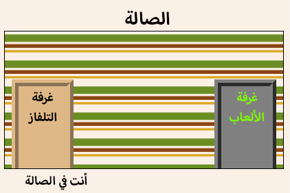

## المقدمة

في هذا المشروع، ستنشئ مجموعة من الغرف المرتبطة بحيث تمثل كل غرفة صفحةَ ويب مختلفة ويمكنك تزيينها عبر ملفات HTML. 

  <iframe src="https://trinket.io/embed/html/ba5d27ec68?outputOnly=true&start=result" width="600" height="450" frameborder="0" marginwidth="0" marginheight="0" allowfullscreen>
  </iframe>
  

__إرشادات__: انقر فوق الأبواب للتنقل بين الغرف.

### معلومات إضافية لقادة النادي

إذا كنت بحاجة إلى طباعة هذا المشروع، فيُرجى استخدام [نسخة سهلة الطباعة](https://projects.raspberrypi.org/en/projects/linked-rooms/print).

--- collapse ---
---
title: ملاحظات قادة النادي
---

## المقدمة:
في هذا المشروع، سيتعرف الأطفال على كيفية الربط بين عدة صفحات ويب في المشروع نفسه بحيث يكون لكل صفحة ملف CSS خاص بها. 

## الموارد المتوفرة على الإنترنت

نوصي باستخدام [trinket](https://trinket.io/) لكتابة ملفات HTML وCSS على الإنترنت. يحتوي هذا المشروع على ملف trinket التالي:

+ ['غرف مرتبطة' مشروع البدء -- jumpto.cc/web-rooms](http://jumpto.cc/web-rooms)

يمكن أن يستخدم الأطفال أيضًا ملف trinket الفارغ هذا [(jumpto.cc/html-blank)](http://jumpto.cc/html-blank) لكتابة ملفات HTML و CSS، أو يمكنهم استخدام قالب trinket هذا [(jumpto.cc/html-template)](http://jumpto.cc/html-template).

كما يوجد مشروع trinket يحتوي على نموذج حل للتحديات:

+ ['مشروع غرف مرتبطة مُكتمل' -- https://trinket.io/html/ba5d27ec68](https://trinket.io/html/ba5d27ec68)

## الموارد المتوفرة دون اتصال بالإنترنت
بالنسبة إلى هذا المشروع، يمكن [إكماله دون اتصال بالإنترنت](https://www.codeclubprojects.org/en-GB/resources/webdev-working-offline/) إذا كنت تفضل ذلك. يمكنك الوصول إلى موارد المشروع من خلال النقر فوق رابط "مواد المشروع" الخاص بهذا المشروع. يحتوي هذا الرابط على قسم "موارد المشروع"، الذي يتضمن الموارد التي يحتاج إليها الأطفال لإكمال هذا المشروع دون اتصال بالإنترنت. تأكد من أن كل طفل لديه حق الوصول إلى نسخة من هذه الموارد. يتضمن هذا القسم الملفات التالية:

+ linked-rooms/index.html
+ linked-rooms/style.css
+ linked-rooms/script.js
+ linked-rooms/prefixfree.js
+ linked-rooms/4 x .png images
+ template/template.html
+ template/style.css

يمكنك أيضًا العثور على نسخة كاملة من تحديات هذا المشروع في قسم "موارد المتطوعين" الذي يحتوي على:

+ linked-rooms-finished/index.html
+ linked-rooms-finished/style.css
+ linked-rooms-finished/script.js
+ linked-rooms-finished/prefixfree.js
+ linked-rooms-finished/4 x .png images

(جميع الموارد المذكورة أعلاه قابلة للتنزيل أيضًا كملفات `.zip` للمشاريع والمتطوعين).

## أهداف التعلم
+ يقدِّم هذا المشروع مشاريع تتضمن عدة صفحات html مرتبطة بعضها ببعض
+ يتضمن المشروع أيضًا ملفات CSS متعددة

يتناول هذا المشروع عناصر من الصفوف التالية من [المناهج الرقمية الخاصة بـ Raspberry Pi](http://rpf.io/curriculum):

+ [الأصول الأساسية للتصميمات ثنائية الأبعاد وثلاثية الأبعاد](https://www.raspberrypi.org/curriculum/design/creator).

## التحديات:
+ "أضف رابطًا آخر" - إضافة رابط بين الصفحات في المشروع نفسه؛
+ "حدِّد نمط Games Room وأضف رابطًا إليها" - إضافة رابط للصفحة وتحديد نمط لها باستخدام ملف CSS الخاص بها. 
+ "أضف أبوابًا أخرى!" - استخدام أوسمة 
 كروابط قابلة للنقر
+ "أضف ورق الحائط إلى Games Room" - إضافة صورة خلفية
+ "أضف إلى مشروعك!" - إضافة غرف أخرى باستخدام المهارات التي تم تعلمها
+ "إضافة مؤشر مفتاح" - ميزة اختيارية رائعة لأولئك الذي يُكملون المشروع

--- /collapse ---

--- collapse ---
---
title: مواد المشروع
---
## موارد المشروع
* [ملف .zip يحتوي على كل موارد المشروع](resources/rooms-project-resources.zip)
* [Trinket عبر الإنترنت يحتوي على كل موارد المشروع 'غرف مرتبطة'](http://jumpto.cc/web-rooms)
* [قالب Trinket عبر الإنترنت](http://jumpto.cc/trinket-template)
* [Trinket فارغ عبر الإنترنت](http://jumpto.cc/trinket-blank)
* [template/index.html](resources/template-index.html)
* [template/style.css](resources/template-style.css)
* [linked-rooms/index.html](resources/linked-rooms-index.html)
* [linked-rooms/style.css](resources/linked-rooms-style.css)
* [linked-rooms/tvroom.html](resources/linked-rooms-tvroom.html)
* [linked-rooms/tvroom.css](resources/linked-rooms-tvroom.css)
* [linked-rooms/wallpaper.png](resources/linked-rooms-wallpaper.png)
* [linked-rooms/space-invader.png](resources/linked-rooms-space-invader.png)
* [linked-rooms/tiles.png](resources/linked-rooms-tiles.png)
* [linked-rooms/star.png](resources/linked-rooms-star.png)
* [linked-rooms/stripes.png](resources/linked-rooms-stripes.png)

## موارد قادة النادي
* [ملف .zip يحتوي على كل موارد المشاريع المكتملة](resources/rooms-volunteer-resources.zip)
* [مشروع Trinket المكتمل على الإنترنت](https://trinket.io/html/1d4d4c5ce1)
* [linked-rooms-finished/index.html](resources/linked-rooms-finished-index.html)
* [linked-rooms-finished/style.css](resources/linked-rooms-finished-style.css)
* [linked-rooms-finished/tvroom.html](resources/linked-rooms-finished-tvroom.html)
* [linked-rooms-finished/tvroom.css](resources/linked-rooms-finished-tvroom.css)
* [linked-rooms-finished/gamesroom.html](resources/linked-rooms-finished-gamesroom.html)
* [linked-rooms-finished/gamesroom.css](resources/linked-rooms-finished-gamesroom.css)
* [linked-rooms-finished/wallpaper.png](resources/linked-rooms-finished-wallpaper.png)
* [linked-rooms-finished/space-invader.png](resources/linked-rooms-finished-space-invader.png)
* [linked-rooms-finished/tiles.png](resources/linked-rooms-finished-tiles.png)
* [linked-rooms-finished/star.png](resources/linked-rooms-finished-star.png)
* [linked-rooms-finished/stripes.png](resources/linked-rooms-finished-stripes.png)

--- /collapse ---