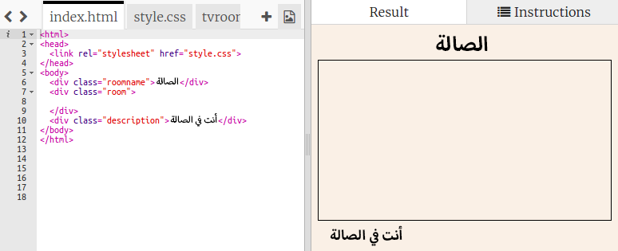
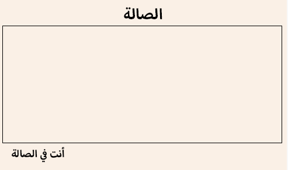
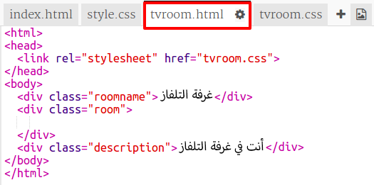
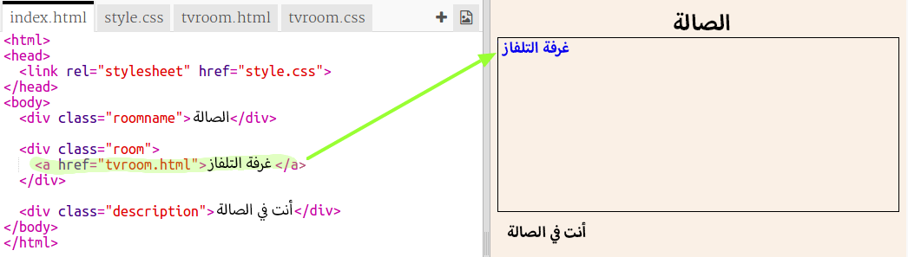
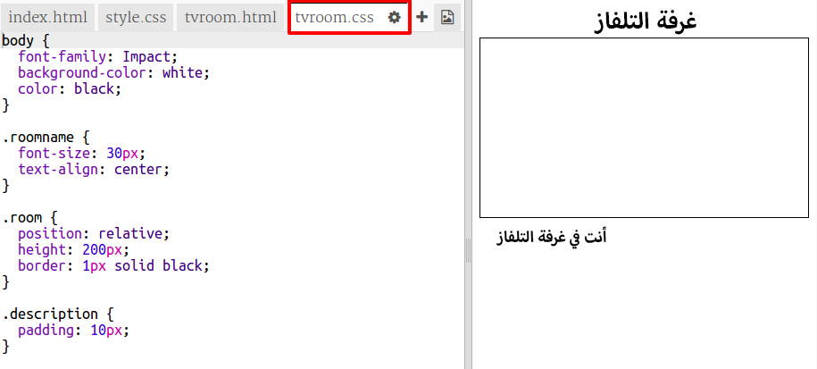

## ربط بصفحة ويب أخرى في المشروع نفسه

مشاريع الإنترنت يمكن أن تتكون من ملفات HTML مرتبطة ببعضها.

+ افتح مشروع trinket هذا: <a href="https://trinket.io/html/f1486ddb24" target="_blank">jumpto.cc/web-rooms</a>.
    
    الآن يجب أن يبدو الملف الخاص بك مثل هذا:
    
    

+ مشروع Trinket سيعمل تلقائياً وستجد نفسك في الصالة:
    
    

+ انظر إلى قائمة الملفات لمشروع Trinket هذا. هل تستطيع رؤية `tvroom.html`؟ اضغط عليه.
    
    
    
    هذا ملف html آخر في نفس المشروع.

+ لتصل إلى `tvroom.html` يجب أن تضيف رابط في ملف `index.html`.
    
    أضف الكود المظلل داخل `
` تحت مسمى `room`:
    
    

+ اختبر مشروع Trinket بالضغط على رابط **غرفة التلفاز** لترى صفحة `tvroom.html`.
    
    لاحظ أن `tvroom.html` لها ملف أنماط `tvroom.css` خاص بها حيث يمكن تحديد تنسيقات الصفحة عن طريقه.
    
    