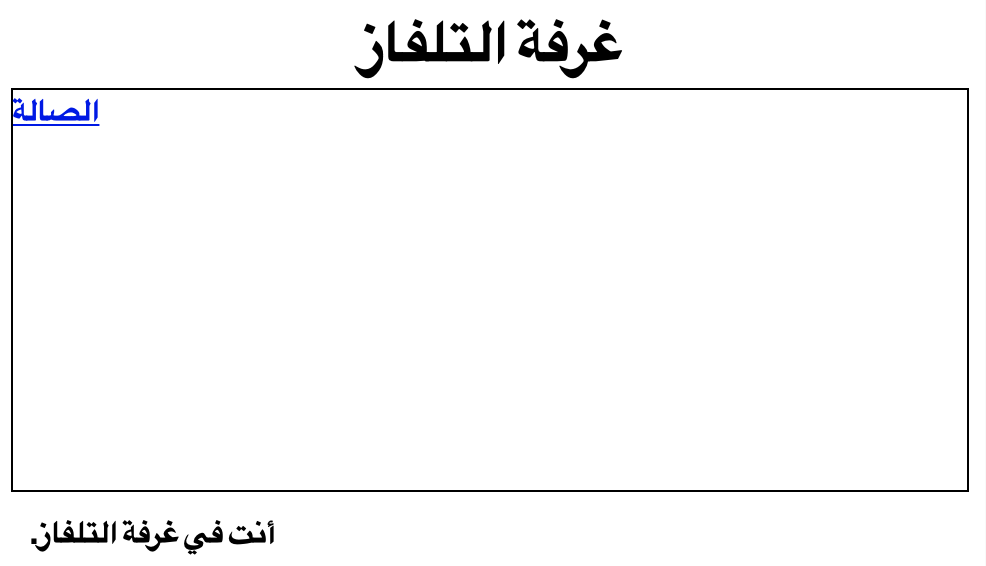

--- challenge ---

## التحدي: أضف رابطًا آخر

أضف رابط `<a>` في صفحة `tvroom.html` حتى يمكن العودة إلى الصالة المعروفة باسم `index.html`. الرابط يجب أن يكون بمسمى "الصالة".

صفحة غرفة التلفاز يجب أن يكون لها رابط مثل هذا:

تأكد من تجربة الكود الذي وضعته. يجب أن تكون قادراً على التنقل بين الصالة وغرفة التلفاز والعودة مرة أخرى عن طريق الضغط على الروابط.

--- /challenge ---