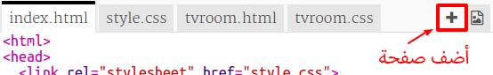
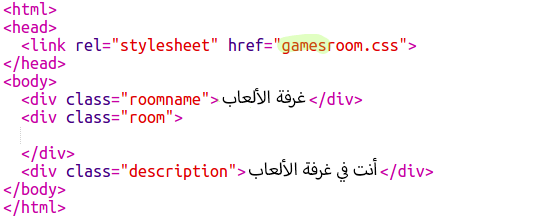
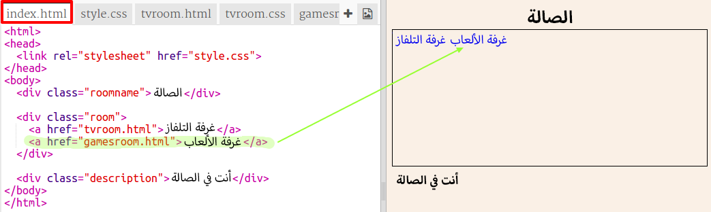
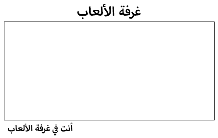

## أضف غرفة أخرى

الآن دعنا نضيف غرفة أخرى، **غرفة الألعاب**.

+ اضغط على زر **+**:
    
    
    
    أكتب `gamesroom.html` كاسم للصفحة:
    
    

+ كود HTML الخاص **بغرفة الألعاب** يشابه `tvroom.html` يمكنك **نسخ** و **لصق** الكود في `gamesroom.html`.
    
    قم بتعديل العناوين المضللة حتى تكون "ألعاب" بدلاً من "تلفاز":
    
    

+ ملف `gamesroom.html` الآن سوف يستخدم `gamesroom.css` الغير موجود بعد.
    
    أنشئ ملف `gamesroom.css` بواسطة الضغط على زر أضف صفحة **+**.

+ كود CSS الخاص **بغرفة الألعاب** يشابه `tvroom.css` يمكنك **نسخ** و **لصق** الكود في `gamesroom.css`.
    
    

+ أضف رابط من الصالة إلى غرفة الألعاب:
    
    

+ قم باختبار مشروعك بالضغط على رابط غرفة الألعاب
    
    **غرفة الألعاب** يجب أن تظهر بالشكل التالي:
    
    
    
    لم يكن بالشئ المثير جداً، لكن يمكن أن يكون مثيراً في التحدي القادم.