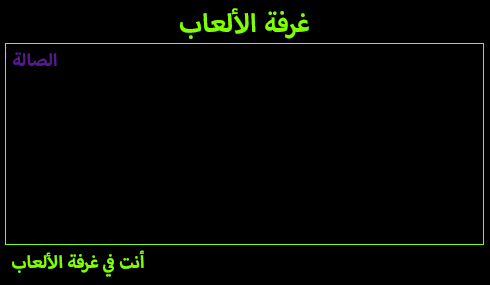

--- challenge ---

## التحدي: حدِّد نمط غرفة الألعاب وأضف رابطًا إليها

قم بتعديل HTML و CSS **لغرفة الألعاب** لتظهر بالشكل التالي:

ملاحظة: يجب أن تقوم بتغيير لون الخلفية، ولون الخط، ولون الحدود في `gamesroom.css`. اللون الأخضر الفاتح يسمى `chartreuse`.

ملاحظة: يجب أن تضيف رابط `<a>` في `gamesroom.html` المتصل بـ `index.html`.

--- /challenge ---