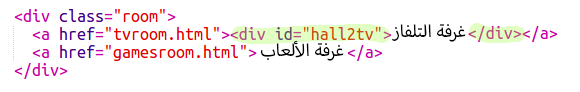
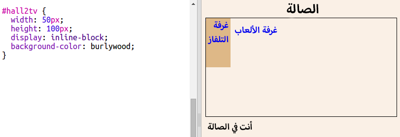
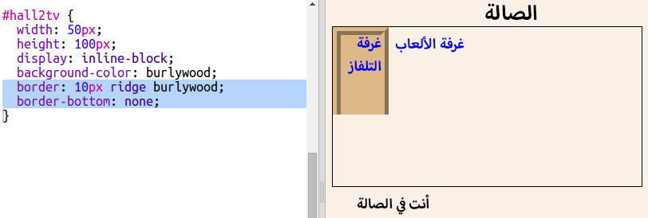
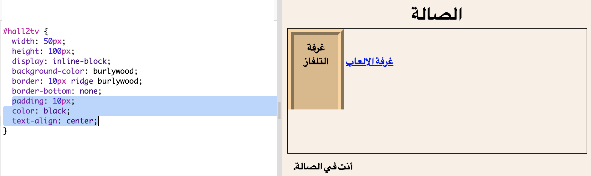
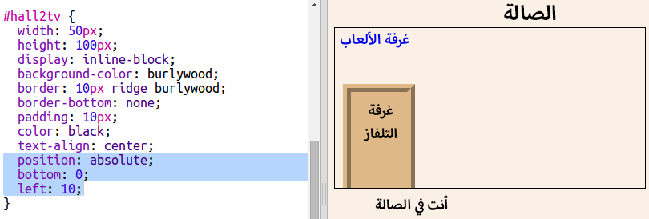

## إنشاء الروابط في شكل أبواب

لا يُشترط أن تكون الروابط في شكل نصوص فحسب. لننشئ رابطًا قابلًا للنقر في شكل باب باستخدام وسم `
`.

+ افتح الملف `index.html` وأضف وسم `
` على جانبَي نص الرابط __TV Room__. ويجب أن يكون هذا الوسم داخل الوسم `<a>` ليكون قابلًا للنقر.

  أضف `id="hall2tv"` لتمييزه كباب من الصفحة Hall إلى الصفحة TV Room حتى يمكنك تحديد نمط الباب. 

    

+ انقر فوق علامة التبويب `style.css`، وانتقل إلى أسفل الملف لإضافة تعليمات CSS البرمجية التالية لتغيير حجم الباب ولونه:

	

+ اختبر صفحة الويب بالنقر فوق أي مكان في الباب، لا على النص فقط.

+ لنجعله الآن يبدو في شكل باب حقيقي بإضافة حد حول ثلاثة جوانب:

	

+ ولنضِف بعض تعليمات CSS البرمجية لتحسين عرض النص الموجود على الباب:

	

+ ربما لاحظتَ أن الباب يبدو وكأنه معلق في الهواء. لنصلح هذا الخطأ بتحديد موضع الباب داخل الغرفة.

		

+ اختبر صفحة الويب بالنقر فوق الباب للانتقال إلى __TV Room__.

