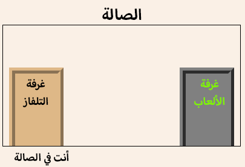
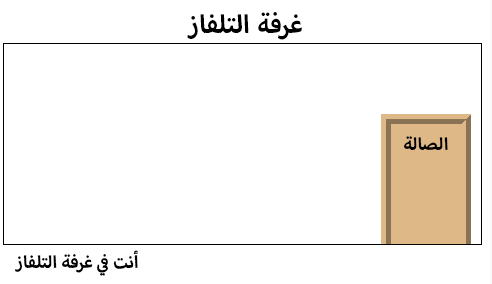

--- challenge ---
## التحدي: أضف أبوابًا أخرى!

اجعل الروابط الأخرى في المشروع تظهر في شكل أبواب بالطريقة نفسها. 

بالنسبة إلى كل باب، ستحتاج إلى:

+ تحرير الرابط الذي يأخذ شكل الباب بحيث يستخدم وسم `
` يتضمن id مثل `hall2games` حتى يمكنك تحديد نمط له. 

	على سبيل المثال: 

	`<a href="gamesroom.html">
Games Room
</a>`

+ أضف تعليمات CSS البرمجية التي تميِّز معرِّف الباب إلى ملف `css.` الخاص بغرفته. استخدم _النسخ_ و_اللصق_ لتوفير الوقت. ويمكنك أن تجعل لكل باب مظهرًا مختلفًا إذا أردتَ. 

+ حدِّد موضع الباب باستخدام القيمتَين `bottom:` و`left:` أو `right:`.

يمكن أن تكون الصفحة Hall بالشكل التالي:

ستكون الصفحة TV Room بالشكل التالي تقريبًا:

	

--- /challenge ---