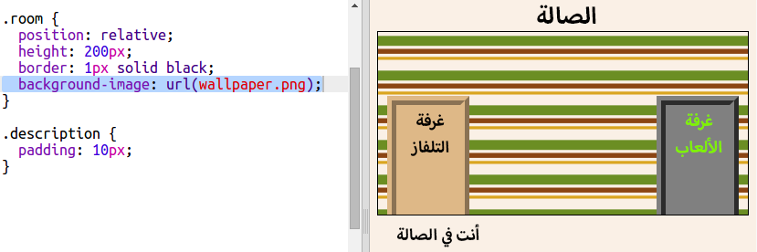

## Adding a background image

Let's decorate the hall with a background image.

+ Edit the `style.css` to add a background image to the Hall:
    
    
    
    The image will be repeated to fill the whole room.