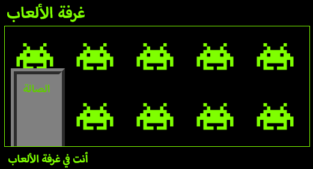

\--- challenge \---

## التحدي: أضف ورق حائط إلى غرفة الألعاب

هل تستطيع تزيين غرفة الألعاب بخلفية صورة؟

يمكنك استخدام الصورة الخلفية الملحقة في مشروعك `space-invader.png`.

ستحتاج إلى:

+ إضافة `background-image:` إلى CSS الخاص بـ `.room` لغرفة الألعاب. 

تزيين الغرفة يجب أن تظهر بالشكل التالي:

\--- /challenge \---