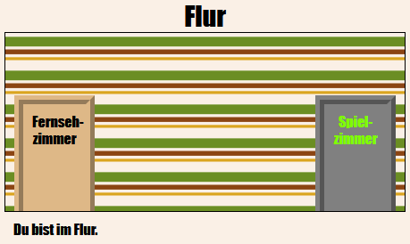

## Einleitung

In diesem Projekt erstellst du eine Reihe verknüpfter Räume, wobei jeder Raum eine andere Webseite ist, die du mit HTML dekorieren kannst.

  <iframe src="https://trinket.io/embed/html/eab49f4f06?outputOnly=true&start=result" width="600" height="450" frameborder="0" marginwidth="0" marginheight="0" allowfullscreen>
  </iframe>
  

**Anleitung**: Klicke auf die Türen, um sich zwischen den Räumen zu bewegen.

### Zusätzliche Information für Clubleiter

Falls du dieses Projekt ausdrucken musst, verwende bitte die [druckfreundliche Version](https://projects.raspberrypi.org/en/projects/linked-rooms/print).

## \--- collapse \---

## title: Anmerkungen für Clubleiter

## Einleitung:

In diesem Projekt werden Kinder an das Konzept von mehreren verknüpften Webseiten im selben Projekt herangeführt, welche jeweils eine eigene CSS-Datei haben.

## Online-Ressourcen

Wir empfehlen [Trinket](https://trinket.io/) als Online-Editor für HTML & CSS. Dieses Projekt enthält das folgende Trinket:

* [Startpunktpunkt 'Linked Rooms' - jumpto.cc/web-rooms](https://trinket.io/html/f1486ddb24)

Die Kinder können auch dieses leere Trinket [(jumpto.cc/html-blank)](http://jumpto.cc/html-blank) verwenden um ihr eigenes HTML & CSS zu schreiben, oder sie können als Alternative dazu dieses Trinket als Vorlage verwenden [(jumpto.cc/html-template)](http://jumpto.cc/html-template).

Es gibt auch ein Trinket mit einer Beispiellösung für die Herausforderungen:

* ['Verknüpfte Räume fertiggestellt' - https://trinket.io/html/ba5d27ec68](https://trinket.io/html/eab49f4f06)

## Offline-Ressourcen

Dieses Projekt kann wahlweise auch [offline](https://www.codeclubprojects.org/en-GB/resources/webdev-working-offline/) durchgeführt werden. Du kannst auf die Projektressourcen zugreifen, indem du auf den Link "Projektmaterial" für dieses Projekt klickst. Dieser Link enthält einen Abschnitt "Projektressourcen" mit Ressourcen, die die Kinder benötigen, um das Projekt offline abschließen zu können. Stelle sicher, dass jedes Kind Zugriff auf eine Kopie dieser Ressourcen hat. Dieser Abschnitt enthält die folgenden Dateien:

* linked-rooms/index.html
* linked-rooms/style.css
* linked-rooms/script.js
* linked-rooms/prefixfree.js
* linked-rooms/ 4 x .png Bilder
* template/template.html
* template/style.css

Eine vollständige Version dieses Projekts findest du auch im Abschnitt "Ressourcen für Freiwillige". Diese enthält:

* linked-rooms-finished/index.html
* linked-rooms-finished/style.css
* linked-rooms-finished/script.js
* linked-rooms-finished/prefixfree.js
* linked-rooms-finished/ 4 x .png Bilder

(Alle oben genannten Ressourcen können auch als `.zip`-Dateien für Projekte und für Freiwillige heruntergeladen werden.)

## Lernziele

* In diesem Projekt werden Projekte vorgestellt, bei denen mehrere HTML-Seiten miteinander verknüpft sind
* Es werden auch mehrere CSS-Dateien eingeführt

Dieses Projekt deckt die folgenden Kernbereiche des [Raspberry Pi Digital Making Curriculum](http://rpf.io/curriculum) ab:

* [Entwurf von grundlegenden 2D- and 3D-Konstruktionen](https://www.raspberrypi.org/curriculum/design/creator).

## Herausforderungen

* „Weitere Verknüpfung hinzufügen“ - Fügt eine Verknüpfung zwischen Seiten im selben Projekt hinzu.
* „Gestalte und verknüpfe das Spielzimmer“ - Füge eine Verknüpfung hinzu und gestalte eine Seite mit einer eigenen CSS-Datei. 
* "Füge weitere Türen hinzu!" - Verwende 

      s als anklickbare Verknüpfungen </li> </ul> 
      
      

        <
      

      
      

        + "Füge eine Tapete zum Spielzimmer hinzu" - Ein Hintergrundbild hinzufügen + "Mach es zu deinem!" - Füge mit den erlernten Fähigkeiten weitere Räume hinzu. + "Füge einen Schlüsselcursor hinzu" - Ein lustiges optionales Extra für diejenigen, die das Projekt abschließen
      

      
      

        --- /collapse ---
      

      
      <h2>
        --- collapse ---
      </h2>
      
      <h2>
        title: Projektmaterial
      </h2>
      
      <h2>
        Projektressourcen
      </h2>
      
      <ul>
        <li>
          <a href="https://rpf.io/p/en/linked-rooms-go">.zip-Datei mit allen Projektressourcen</a>
        </li>
        <li>
          <a href="http://jumpto.cc/web-rooms">Online-Trinket mit allen Projektressourcen für "verknüpfte Räume"</a>
        </li>
        <li>
          <a href="http://jumpto.cc/trinket-template">Online Trinket-Vorlage</a>
        </li>
        <li>
          <a href="http://jumpto.cc/trinket-blank">Leeres online-Trinket</a>
        </li>
        <li>
          <a href="resources/template-index.html">template/index.html</a>
        </li>
        <li>
          <a href="resources/template-style.css">template/style.css</a>
        </li>
        <li>
          <a href="resources/linked-rooms-index.html">linked-rooms/index.html</a>
        </li>
        <li>
          <a href="resources/linked-rooms-style.css">linked-rooms/style.css</a>
        </li>
        <li>
          <a href="resources/linked-rooms-tvroom.html">linked-rooms/tvroom.html</a>
        </li>
        <li>
          <a href="resources/linked-rooms-tvroom.css">linked-rooms/tvroom.css</a>
        </li>
        <li>
          <a href="resources/linked-rooms-wallpaper.png">linked-rooms/wallpaper.png</a>
        </li>
        <li>
          <a href="resources/linked-rooms-space-invader.png">linked-rooms/space-invader.png</a>
        </li>
        <li>
          <a href="resources/linked-rooms-tiles.png">linked-rooms/tiles.png</a>
        </li>
        <li>
          <a href="resources/linked-rooms-star.png">linked-rooms/star.png</a>
        </li>
        <li>
          <a href="resources/linked-rooms-stripes.png">linked-rooms/stripes.png</a>
        </li>
      </ul>
      
      <h2>
        Ressourcen für Clubleiter
      </h2>
      
      <ul>
        <li>
          <a href="https://rpf.io/p/en/linked-rooms-go">.zip-Datei mit allen fertig gestellten Projektressourcen</a>
        </li>
        <li>
          <a href="https://trinket.io/html/eab49f4f06">Vollständiges Trinket-Projekt (online)</a>
        </li>
        <li>
          <a href="resources/linked-rooms-finished-index.html">linked-rooms-finished/index.html</a>
        </li>
        <li>
          <a href="resources/linked-rooms-finished-style.css">linked-rooms-finished/style.css</a>
        </li>
        <li>
          <a href="resources/linked-rooms-finished-tvroom.html">linked-rooms-finished/tvroom.html</a>
        </li>
        <li>
          <a href="resources/linked-rooms-finished-tvroom.css">linked-rooms-finished/tvroom.css</a>
        </li>
        <li>
          <a href="resources/linked-rooms-finished-gamesroom.html">linked-rooms-finished/gamesroom.html</a>
        </li>
        <li>
          <a href="resources/linked-rooms-finished-gamesroom.css">linked-rooms-finished/gamesroom.css</a>
        </li>
        <li>
          <a href="resources/linked-rooms-finished-wallpaper.png">linked-rooms-finished/wallpaper.png</a>
        </li>
        <li>
          <a href="resources/linked-rooms-finished-space-invader.png">linked-rooms-finished/space-invader.png</a>
        </li>
        <li>
          <a href="resources/linked-rooms-finished-tiles.png">linked-rooms-finished/tiles.png</a>
        </li>
        <li>
          <a href="resources/linked-rooms-finished-star.png">linked-rooms-finished/star.png</a>
        </li>
        <li>
          <a href="resources/linked-rooms-finished-stripes.png">linked-rooms-finished/stripes.png</a>
        </li>
      </ul>
      
      

        --- /collapse ---
      
