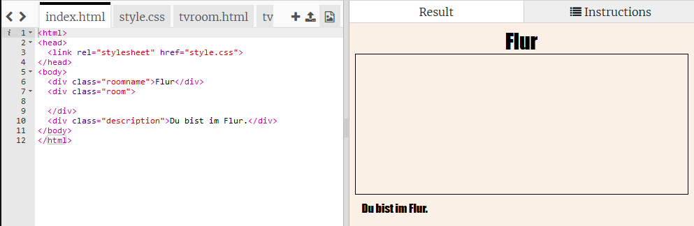
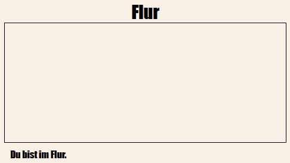
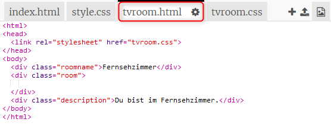
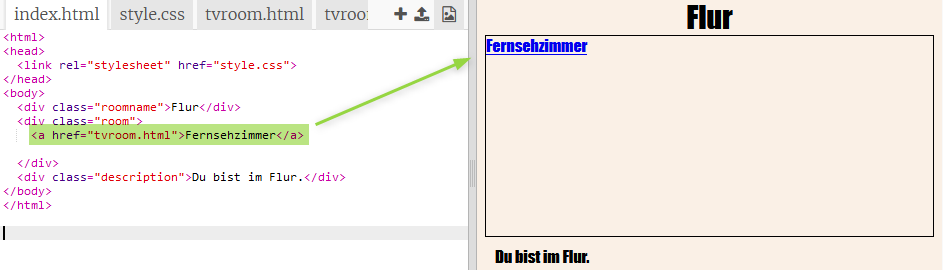
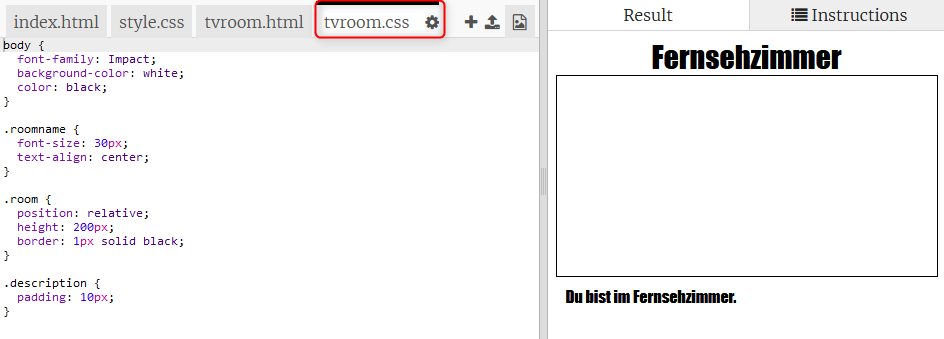

## Stelle eine Verknüpfung zu einer anderen Webseite im gleichen Projekt her

Webprojekte können aus vielen miteinander verknüpften HTML-Dateien bestehen.

+ Öffne dieses Trinket: <a href="https://trinket.io/html/f1486ddb24" target="_blank">jumpto.cc/web-rooms</a>.
    
    Das Projekt sollte so aussehen:
    
    

+ Das Trinket sollte automatisch ausgeführt werden und du wirst dich im Flur befinden:
    
    

+ Sieh dir die Liste der Datei-Reiter für dieses Trinket an. Kannst du `tvroom.html` sehen? Klick es an.
    
    
    
    Dies ist eine weitere HTML-Datei im selben Projekt.

+ Um zu `tvroom.html` zu gelangen, musst du eine Verknüpfung (in der Regel wird in der Webentwicklung das englische Wort "Link" verwendet) zu `index.html` hinzufügen.
    
    Füge den markierten Code innerhalb des `
` mit der Klasse (engl.: class) `room` hinzu:
    
    

+ Teste dein Trinket, indem du auf den **Fernsehzimmer** Link klickst, um die Webseite `tvroom.html` aufzurufen.
    
    Beachte, dass `tvroom.html` auch eine eigene `tvroom.css` Style-Datei hat, die das Layout für diese Seite definiert.
    
    