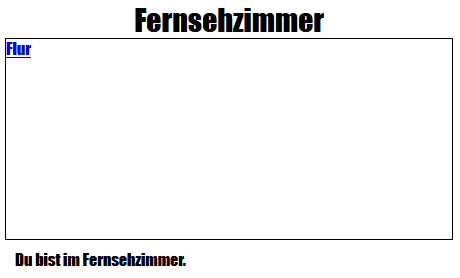

\--- challenge \---

## Challenge: Add another link

Add an `<a>` link to the `tvroom.html` webpage to get you back to the Hall webpage which is called `index.html`. The link text should be 'Hall'.

The TV Room webpage should then have a clickable link like this:

Make sure you test your code. You should be able to move from the Hall to the TV Room and back again by clicking on links.

\--- /challenge \---