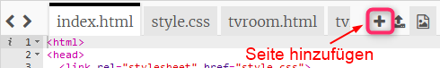
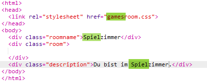
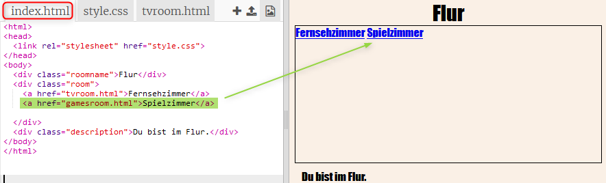
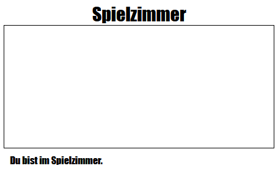

## Füge noch ein Zimmer hinzu

Lass uns jetzt ein weiteres Zimmer, einen __Games Room__ (Spielzimmer) hinzufügung. 

+ Klick auf der Hinzufügen Seite, die __+__ Taste:

	

	Tippe `gamesroom.html` (Spielzimmer) als deinen Seitennamen ein:

 	

+ Das HTML für den __Games Room__ ist sehr ähnlich wie zum `tvroom.html`, __kopiere__ dies daher und __füge__ es in `gamesroom.html` ein.
	
	Bearbeite die markierten Posten, damit es sich wie „Games“ (Spielzimmer) und nicht „TV“ (Fernsehzimmer) liest:

		

+ Dein `gamesroom.html` benutzt jetzt `gamesroom.css`, was bislang noch nicht exisitert. 

	Erstelle `gamesroom.css`, indem du auf die __+__ Taste auf der Hinzufügen-Seite klickst. 

+ Der CSS Code für das __Spielzimmer__ ist sehr ähnlich wie zum `tvroom.css`, __kopiere__ dies daher und __füge__ es in `gamesroom.css` ein.

	

+ Füge einen Link vom Flur zum Spielzimmer hinzu:

	

+ Teste dein Projekt, indem du auf den Spielzimmer-Link klickst

	Das __Spielzimmer__ sollte so aussehen:

	

	Nicht gerade sehr spannend, aber du kannst das in der nächsten Aufgabe beheben. 

