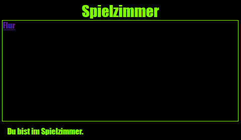

--- challenge ---
## Aufgabe: Gestalte das Spielzimmer und stelle einen Link hierzu her

Bearbeite den HTML und CSS Code für das __Spielzimmer__ , damit die Webseite so aussieht: 

Tipp: Du wirst die Hintergrundfarbe, die Farbe der Schriftart sowie die Farbe des Rahmens in `gamesroom.css` ändern müssen. Die hellgrüne Farbe nennt sich `chartreuse`.  

Tipp: Du wirst einen `<a>` Link im `gamesroom.html` hinzufügen müssen, der sich mit dem `hall.html` (Flur) verknüpft.

--- /challenge ---