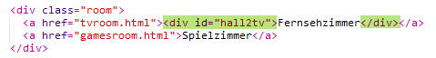
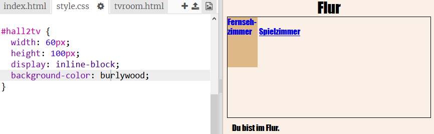
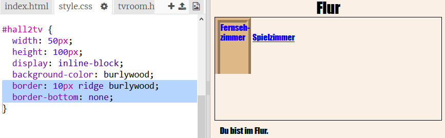
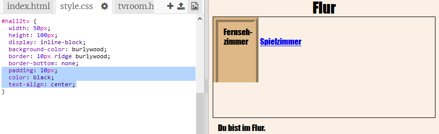
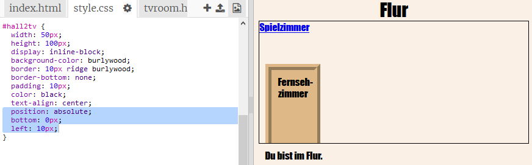

## Lasse die Links wie Türen aussehen

Links müssen nicht nur Text sein. Machen wir eine anklickbare Tür, indem wir ein `
` verwenden.

+ Öffne `index.html` und füge ein `
` um den **Fernsehraum** Linktext hinzu. Es muss sich innerhalb des `<a>` Tags sein, damit es angeklickt werden kann.
    
    Füge `id="hall2tv"` ("hall2tv" ist eine anglische Abkürzung und meint soviel wie "FlurZuFernseh"), um es als die Tür von der Halle zum Fernsehzimmer zu kennzeichnen, damit du die Tür gestalten kannst.
    
    

+ Klicke auf die Registerkarte `style.css`, gehe nach unten und füge das folgende CSS hinzu, um die Größe und Farbe der Tür zu ändern:
    
    

+ Teste deine Webseite, indem du irgendwo auf die Tür klickst, nicht nur auf den Text. (Vielleicht musst du den Linktext ein wenig ändern, damit er auf die Tür passt.).

+ Lass es jetzt noch ein bisschen mehr wie eine Tür aussehen, indem Du einen Rand um drei Seiten hinzufügst:
    
    

+ Und lass uns CSS hinzufügen, damit der Text an der Tür besser aussieht:
    
    

+ Du hast wahrscheinlich bemerkt, dass die Tür in der Luft schwebt. Lass uns das beheben, indem du die Tür im Raum positionierst.
    
    

+ Teste deine Webseite, indem du auf die Tür klickst, um zum **Fernsehzimmer** zu gelangen.