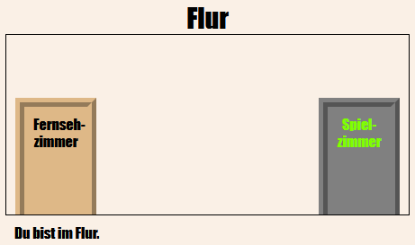
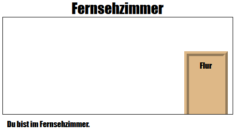

--- challenge ---

## Herausforderung: Füge weitere Türen hinzu!

Verwandele die anderen Links in deinem Projekt auf die gleiche Weise in Türen.

Für jede Tür musst du:

+ Den Tür-Link bearbeiten, um ein `
` mit einer id wie `hall2games` zu verwenden, damit du sie gestalten kannst.
    
    Zum Beispiel:
    
    `<a href="gamesroom.html">
Spielzimmer
</a>`

+ CSS für die Tür-ID zur `.css`-Datei für den Raum hinzufügen. Verwende *kopieren* und *einfügen*, um Zeit zu sparen. Du kannst jede Tür anders aussehen lassen, wenn du möchtest.

+ Die Tür positionieren, indem du `bottom:` und `left:` oder `right:` verwendest.

Der Flur könnte so aussehen:

Der Fernsehraum sollte ungefähr so aussehen:

--- /challenge ---