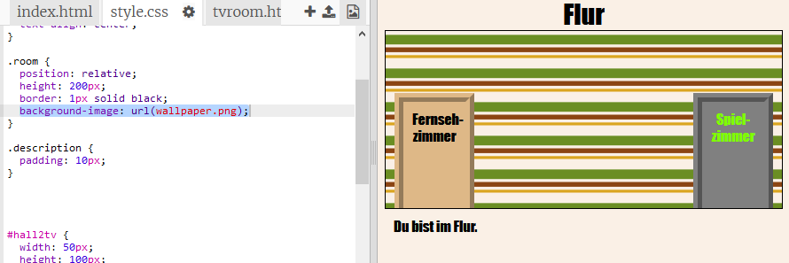

## Ein Hintergrundbild hinzufügen

Verschönern wir den Flur mit einem Hintergrundbild.

+ Bearbeite die `style.css` Datei, um dem Flur ein Hintergrundbild (engl.: background-image) hinzuzufügen:
    
    
    
    Das Bild wird wiederholt, um den gesamten Raum zu füllen.