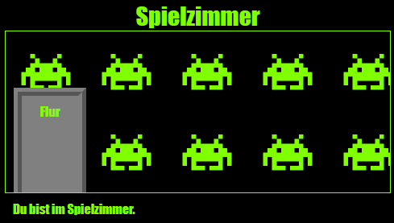

\--- challenge \---

## Herausforderung: Füge eine Tapete zum Spielzimmer hinzu

Kannst du das Spielzimmer mit einem Hintergrundbild dekorieren?

Du kannst das Hintergrundbild `space-invader.png` nutzen, das in deinem Projekt enthalten ist.

Dazu musst du:

+ Ein Hintergrundbild (`background-image:`) zum `.room` CSS für das Spielzimmer hinzufügen. 

Das dekorierte Zimmer sollte so aussehen:

\--- /challenge \---