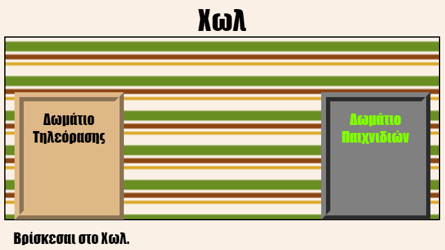

## Εισαγωγή

Σε αυτό το έργο θα δημιουργήσεις μια σειρά από συνδεδεμένα δωμάτια σε ξεχωριστές ιστοσελίδες το καθένα, τα οποία μπορείς να διακοσμήσεις με HTML.

  <iframe src="https://trinket.io/embed/html/8ba7c1e677?outputOnly=true&start=result" width="600" height="450" frameborder="0" marginwidth="0" marginheight="0" allowfullscreen>
  </iframe>
  

**Οδηγίες**: Πάτησε στις πόρτες για να μετακινηθείς στα διάφορα δωμάτια.

### Πρόσθετες πληροφορίες για τους συντονιστές των ομάδων

Αν χρειαστεί να εκτυπώσεις αυτό το έργο, χρησιμοποίησε την [εκτυπώσιμη έκδοση](https://projects.raspberrypi.org/el-GR/projects/linked-rooms/print).

--- collapse ---
---
title: Σημειώσεις συντονιστή ομάδας
---
## Εισαγωγή:

Σε αυτό το έργο παρουσιάζονται στα παιδιά πολλαπλές συνδεδεμένες ιστοσελίδες του ίδιου έργου, κάθε μια με το δικό της CSS αρχείο.

## Online Πόροι

Συνιστούμε να χρησιμοποιήσεις την εφαρμογή [trinket](https://trinket.io/) για να γράψεις HTML & CSS online. Αυτό το έργο περιλαμβάνει το ακόλουθο trinket:

* ['Συνδεδεμένα Δωμάτια' αρχικό στάδιο -- trinket.io/html/da08577641](https://trinket.io/html/da08577641)

Τα παιδιά μπορούν επίσης να χρησιμοποιήσουν αυτό το κενό trinket [(jumpto.cc/html-blank)](http://jumpto.cc/html-blank) για να γράψουν το δικό τους HTML & CSS κώδικα, ή εναλλακτικά μπορούν να χρησιμοποιήσουν αυτό το trinket πρότυπο [(jumpto.cc/html-template)](http://jumpto.cc/html-template).

Υπάρχει επίσης ένα trinket που περιέχει ένα παράδειγμα λύσης για τις προκλήσεις:

* ['Ολοκληρωμένη μορφή Συνδεδεμένων Δωματίων' -- https://trinket.io/html/8ba7c1e677](https://trinket.io/html/8ba7c1e677)

## Offline Πόροι

Αυτό το έργο μπορεί να [ολοκληρωθεί εκτός σύνδεσης](https://www.codeclubprojects.org/en-GB/resources/webdev-working-offline/) αν προτιμάς. Μπορείς να αποκτήσεις πρόσβαση στους πόρους του έργου κάνοντας κλικ στο σύνδεσμο 'Υλικό έργου'. Αυτός ο σύνδεσμος περιέχει μια ενότητα 'Πόροι έργου', η οποία περιλαμβάνει πόρους που θα χρειαστούν τα παιδιά για να ολοκληρώσουν αυτό το έργο εκτός σύνδεσης. Βεβαιωθείτε ότι κάθε παιδί έχει πρόσβαση σε ένα αντίγραφο αυτών των πόρων. Αυτή η ενότητα περιλαμβάνει τα ακόλουθα αρχεία:

* linked-rooms/index.html
* linked-rooms/style.css
* linked-rooms/script.js
* linked-rooms/prefixfree.js
* linked-rooms/4 x .png images
* template/template.html
* template/style.css

Μπορείτε επίσης να βρείτε μια ολοκληρωμένη έκδοση των προκλήσεων αυτού του έργου στην ενότητα 'Πόροι εθελοντών', η οποία περιέχει:

* linked-rooms-finished/index.html
* linked-rooms-finished/style.css
* linked-rooms-finished/script.js
* linked-rooms-finished/prefixfree.js
* linked-rooms-finished/4 x .png images

(Όλοι οι παραπάνω πόροι μπορούν επίσης να κατεβούν ως συμπιεσμένα `.zip` αρχεία.)

## Στόχοι μάθησης

* Αυτό το έργο παρουσιάζει έργα με πολλαπλές html σελίδες συνδεδεμένες μεταξύ τους
* Παρουσιάζονται επίσης πολλαπλά CSS αρχεία

Αυτό το έργο καλύπτει στοιχεία από τις ακόλουθες πτυχές του [Raspberry Pi Digital Curriculum Making](http://rpf.io/curriculum):

* [Σχεδιασμός βασικών στοιχείων 2D και 3D](https://www.raspberrypi.org/curriculum/design/creator).

## Προκλήσεις

* "Πρόσθεσε άλλον ένα σύνδεσμο" - Προσθήκη συνδέσμου μεταξύ των σελίδων που ανήκουν στο ίδιο έργο˙
* "Μορφοποίησε και σύνδεσε το Δωμάτιο Παιχνιδιών" - Προσθήκη συνδέσμου και μορφοποίησης μιας σελίδας χρησιμοποιώντας ένα δικό της CSS αρχείο. 
* "Πρόσθεσε περισσότερες πόρτες!" - Χρήση 

<

div> ως ενεργοί σύνδεσμοι + "Πρόσθεσε ταπετσαρία στο Δωμάτιο των Παιχνιδιών" - Προσθήκη εικόνας φόντου + "Κάν΄ το δικό σου!" - Προσθήκη περισσότερων δωματίων με την χρήση των δεξιοτήτων που αποκτήθηκαν + "Προσθήκη δείκτη ποντικιού με το σχήμα κλειδιού" - Μία διασκεδαστική επιπλέον επιλογή για όσους έχουν ολοκληρώσει το έργο

--- /collapse ---

--- collapse ---
---
title: Υλικά του έργου
---
## Πόροι έργου

* [αρχείο .zip που περιέχει όλους τους πόρους του έργου](resources/rooms-project-resources.zip)
* [Online Trinket που περιέχει όλους τους πόρους του έργου 'Συνδεδεμένα Δωμάτια'](http://trinket.io/html/da08577641)
* [Online πρότυπο Trinket](http://jumpto.cc/trinket-template)
* [Online κενό Trinket](http://jumpto.cc/trinket-blank)
* [template/index.html](resources/template-index.html)
* [template/style.css](resources/template-style.css)
* [linked-rooms/index.html](resources/linked-rooms-index.html)
* [linked-rooms/style.css](resources/linked-rooms-style.css)
* [linked-rooms/tvroom.html](resources/linked-rooms-tvroom.html)
* [linked-rooms/tvroom.css](resources/linked-rooms-tvroom.css)
* [linked-rooms/wallpaper.png](resources/linked-rooms-wallpaper.png)
* [linked-rooms/space-invader.png](resources/linked-rooms-space-invader.png)
* [linked-rooms/tiles.png](resources/linked-rooms-tiles.png)
* [linked-rooms/star.png](resources/linked-rooms-star.png)
* [linked-rooms/stripes.png](resources/linked-rooms-stripes.png)

## Πόροι για τον συντονιστή της ομάδας

* [αρχείο .zip που περιέχει όλους τους πόρους του έργου](resources/rooms-volunteer-resources.zip)
* [Το ολοκληρωμένο έργο online στο Τrinket](https://trinket.io/html/8ba7c1e677)
* [linked-rooms-finished/index.html](resources/linked-rooms-finished-index.html)
* [linked-rooms-finished/style.css](resources/linked-rooms-finished-style.css)
* [linked-rooms-finished/tvroom.html](resources/linked-rooms-finished-tvroom.html)
* [linked-rooms-finished/tvroom.css](resources/linked-rooms-finished-tvroom.css)
* [linked-rooms-finished/gamesroom.html](resources/linked-rooms-finished-gamesroom.html)
* [linked-rooms-finished/gamesroom.css](resources/linked-rooms-finished-gamesroom.css)
* [linked-rooms-finished/wallpaper.png](resources/linked-rooms-finished-wallpaper.png)
* [linked-rooms-finished/space-invader.png](resources/linked-rooms-finished-space-invader.png)
* [linked-rooms-finished/tiles.png](resources/linked-rooms-finished-tiles.png)
* [linked-rooms-finished/star.png](resources/linked-rooms-finished-star.png)
* [linked-rooms-finished/stripes.png](resources/linked-rooms-finished-stripes.png)

--- /collapse ---