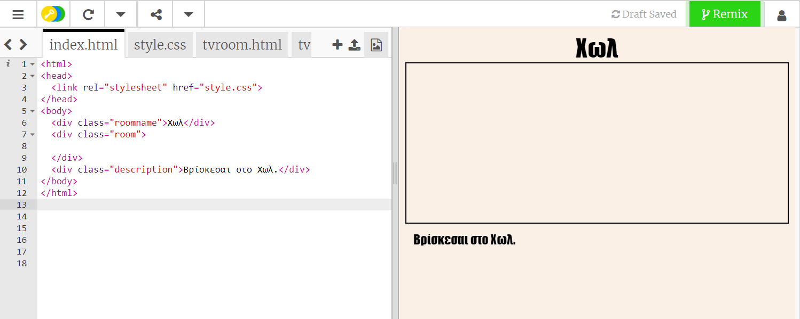
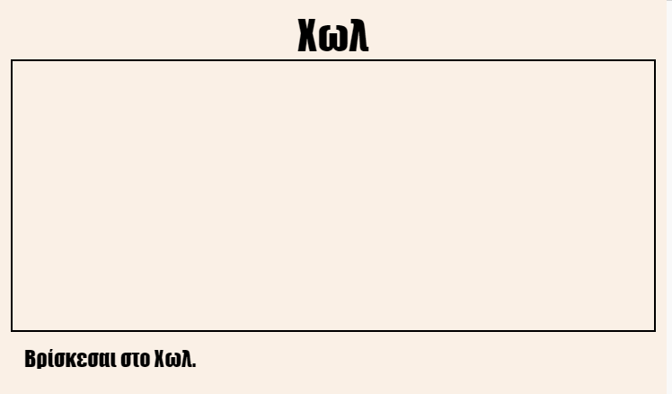
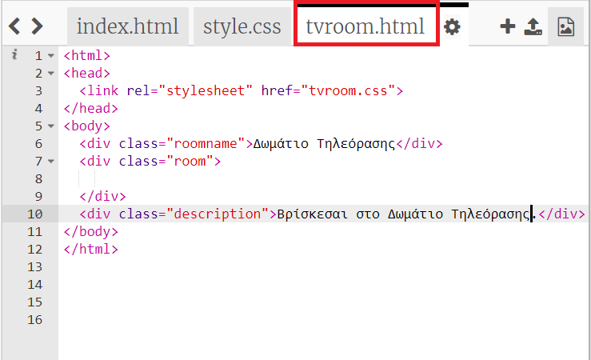
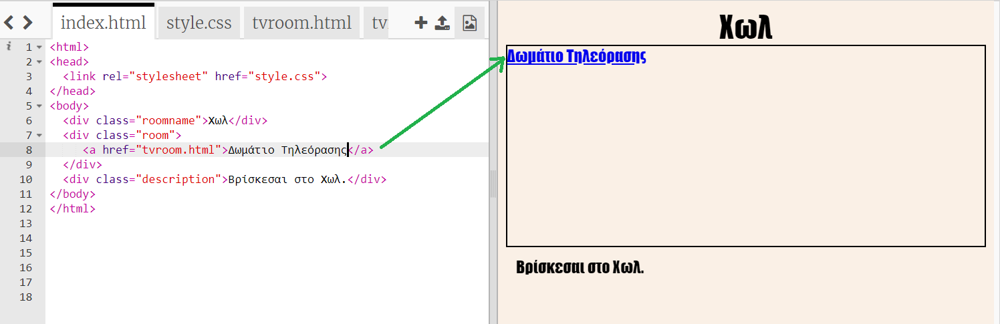
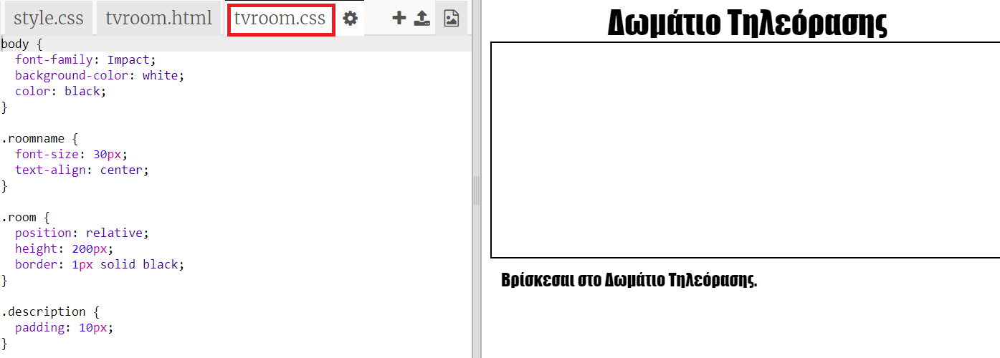

## Δημιουργία συνδέσμου με μια άλλη ιστοσελίδα στο ίδιο έργο

Τα web έργα μπορούν να γίνουν από πολλά HTML αρχεία συνδεδεμένα μεταξύ τους.

+ Άνοιξε αυτό το trinket: <a href="https://trinket.io/html/f1486ddb24" target="_blank">jumpto.cc/web-rooms</a>.
    
    Το έργο/σχέδιο θα πρέπει να μοιάζει σαν αυτό:
    
    

+ Το trinket πρέπει να τρέξει μόνο του και θα βρεθείς στο Χωλ:
    
    

+ Κοίτα τη λίστα με τις καρτέλες αρχείων που υπάρχουν σε αυτό το trinket. Μπορείς να δεις το `tvroom.html`; Πάτησέ το.
    
    
    
    Αυτό είναι άλλο ένα html αρχείο στο ίδιο έργο.

+ Για να πας στο `tvroom.html` θα πρέπει να προσθέσεις έναν σύνδεσμο στο `index.html`.
    
    Πρόσθεσε τον κώδικα που έχει τονιστεί μέσα στο `
` με την class `room`:
    
    

+ Έλεγξε το trinket με το να πατήσεις πάνω στον σύνδεσμο **Δωμάτιο TV** για να δεις τη ιστοσελίδα `tvroom.html`.
    
    Παρατήρησε ότι το `tvroom.html` επίσης έχει το δικό του αρχείο διακόσμησης `tvroom.css` που καθορίζει το σχέδιο αυτής της σελίδας.
    
    