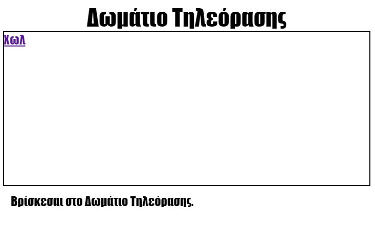

\--- challenge \---

## Πρόκληση: Πρόσθεσε άλλον ένα σύνδεσμο

Πρόσθεσε έναν `<a>` σύνδεσμο στην ιστοσελίδα `tvroom.html` για να μπορείς να πας πίσω στην ιστοσελίδα Χωλ που ονομάζετε `index.html`. Το όνομα του συνδέσμου θα πρέπει να είναι 'Χωλ'.

Η ιστοσελίδα το Δωματίου TV θα πρέπει να έχει έναν ενεργό σύνδεσμο σαν αυτόν:

Σιγουρέψου πως έλεγξες το νέο σου κώδικα. Θα πρέπει να μπορείς να μετακινηθείς από το Χωλ στο Δωμάτιο TV και πίσω πάλι πατώντας στους συνδέσμους.

\--- /challenge \---