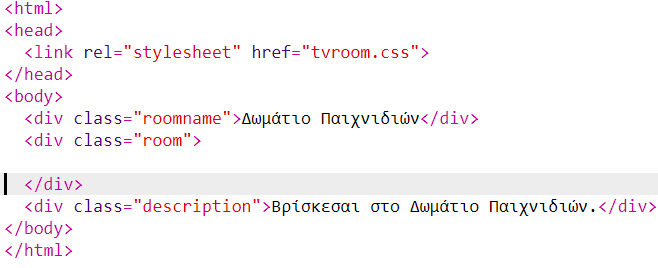
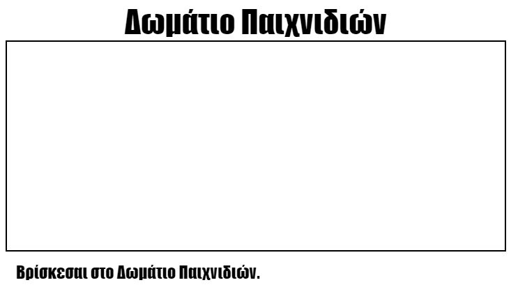

## Πρόσθεσε άλλο ένα δωμάτιο

Τώρα ας προσθέσουμε άλλο ένα δωμάτιο, το **Δωμάτιο των Games**.

+ Πάτησε το κουμπί **+** για προσθήκη νέας σελίδας:
    
    
    
    Πληκτρολόγησε `gamesroom.html` ως όνομα σελίδας:
    
    

+ Η HTML για το **Δωμάτιο των Games** είναι παρόμοια με το `tvroom.html` άρα κάνε **αντιγραφή** και **επικόληση** στο `gamesroom.html`.
    
    Άλλαξε τα τονισμένα σημεία έτσι ώστε να λένε των Games και όχι TV:
    
    

+ Το δικό σου `gamesroom.html` τώρα χρησιμοποιεί το `gamesroom.css` που δεν υπάρχει ακόμα.
    
    Δημιούργησε το `gamesroom.css` με το να πατήσεις το κουμπί **+** για προσθήκη νέας σελίδας.

+ Η CSS για το **Δωμάτιο των Games** είναι παρόμοια με το `tvroom.css` άρα κάνε **αντιγραφή** και **επικόληση** στο `gamesroom.css`.
    
    

+ Πρόσθεσε έναν σύνδεσμο από το Χωλ στο Δωμάτιο των Games:
    
    

+ Έλεγξε το έργο σου με το να πατήσεις τον σύνδεσμο του Δωματίου Games
    
    Το **Δωμάτιο Games** θα πρέπει να μοιάζει σαν αυτό:
    
    
    
    Δεν είναι πολύ συναρπαστικό, μπορείς όμως να το διορθώσεις στην επόμενη πρόκληση.