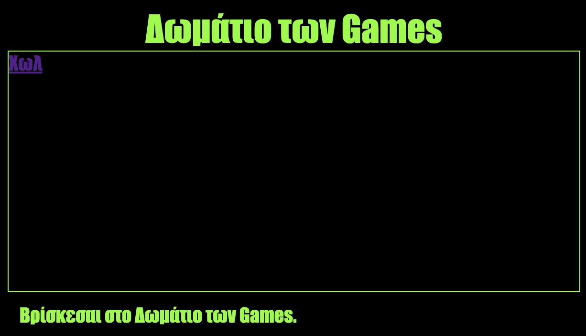

\--- challenge \---

## Πρόκληση: Διακόσμησε και σύνδεσε το Δωμάτιο των Games

Άλλαξε την HTML και την CSS για το **Δωμάτιο των Games** έτσι ώστε να δείχνει έτσι η ιστοσελίδα:

Συμβουλή: Θα χρειαστεί να αλλάξεις τα στοιχεία χρώμα του φόντου, γραμμάτων και το χρώμα του πλαισίου στο `gamesroom.css`. Το φωτεινό πράσινο χρώμα ονομάζετε `chartreuse`.

Συμβουλή: Θα χρειαστεί να προσθέσεις έναν σύνδεσμο `<a>` στο `gamesroom.html` ο οποίος θα πηγαίνει στο `index.html`.

\--- /challenge \---