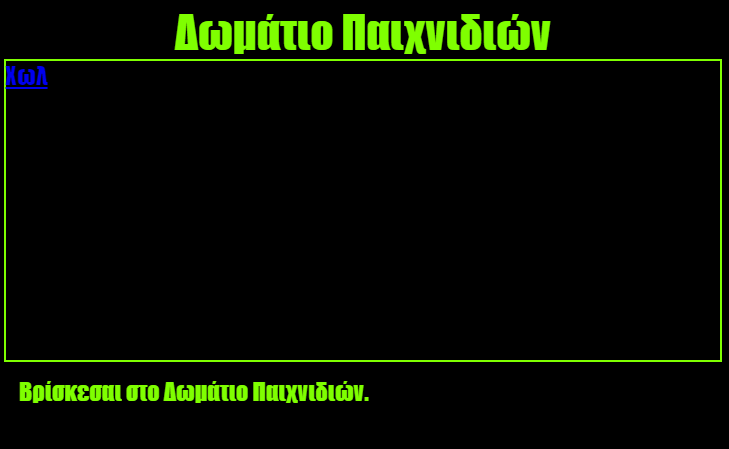

--- challenge ---

## Πρόκληση: Διακόσμησε και σύνδεσε το Δωμάτιο Παιχνιδιών

Άλλαξε την HTML και την CSS για το **Δωμάτιο Παιχνιδιών** έτσι ώστε να δείχνει η ιστοσελίδα όπως παρακάτω:

Συμβουλή: Θα χρειαστεί να αλλάξεις το χρώμα του φόντου, το χρώμα των γραμμάτων και το χρώμα του πλαισίου στο `gamesroom.css`. Το φωτεινό πράσινο χρώμα ονομάζεται `chartreuse`.

Συμβουλή: Θα χρειαστεί να προσθέσεις έναν σύνδεσμο `<a>` στο `gamesroom.html` ο οποίος θα οδηγεί στο `index.html`.

--- /challenge ---