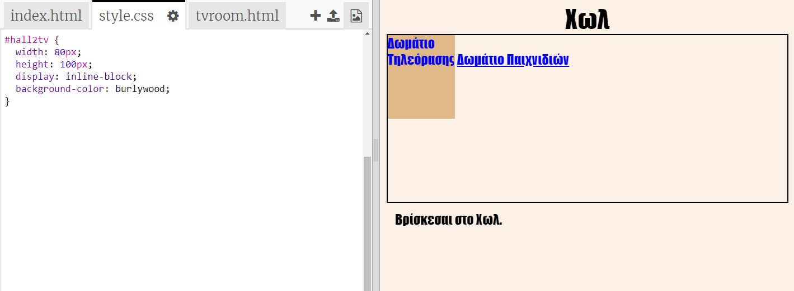
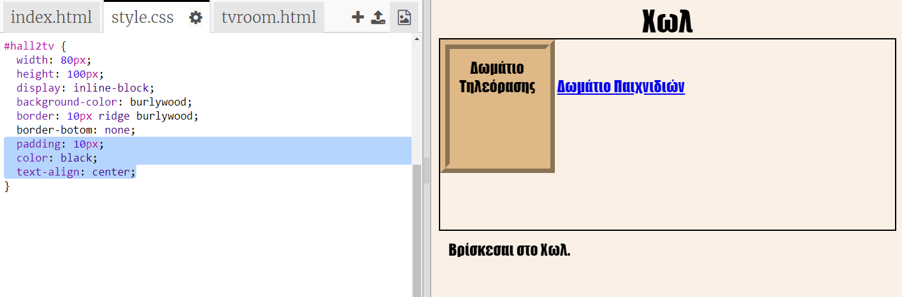
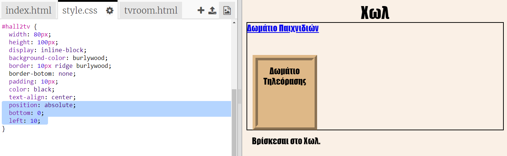

## Κάνε τους συνδέσμους να μοιάζουν με πόρτες

Οι σύνδεσμοι δεν είναι απαραίτητο να είναι μόνο κείμενο. Ας δημιουργήσουμε μια πόρτα, η οποία έχει τη δυνατότητα "κλικ" με το ποντίκι. χρησιμοποιώντας ένα `
`.

+ Άνοιξε το `index.html` και πρόσθεσε ένα `
` γύρω από το κείμενο συνδέσμου του **Δωματίου Τηλεόρασης**. Χρειάζεται να είναι μέσα στο `<a>` για να είναι δυνατό να το κλικάρεις.
    
    Πρόσθεσε `id="hall2tv"` για να την ονομάσεις ως την πόρτα από το Χωλ στο Δωμάτιο Τηλεόρασης έτσι ώστε να μορφοποιήσεις την πόρτα.
    
    

+ Κάνε κλικ στην καρτέλα `style.css`, πήγαινε στο κάτω μέρος και πρόσθεσε τον παρακάτω κώδικα CSS για να αλλάξεις το μέγεθος και το χρώμα της πόρτας:
    
    

+ Δοκίμασε την ιστοσελίδα σου κλικάροντας οπουδήποτε πάνω στην πόρτα κι όχι μόνο πάνω στο κείμενο.

+ Τώρα ας την κάνουμε να μοιάζει περισσότερο με πόρτα προσθέτοντας ένα πλαίσιο γύρω από τις τρεις πλευρές:
    
    

+ Κι ας προσθέσουμε λίγο κώδικα CSS για να κάνουμε το κείμενο στην πόρτα να φαίνεται ομορφότερο:
    
    

+ Προφανώς παρατήρησες ότι η πόρτα είναι εκτός θέσης. Ας το διορθώσουμε αυτό τοποθετώντας την μέσα στο δωμάτιο.
    
    

+ Δοκίμασε την ιστοσελίδα σου κλικάροντας την πόρτα για να οδηγηθείς στο **Δωμάτιο Τηλεόρασης**.