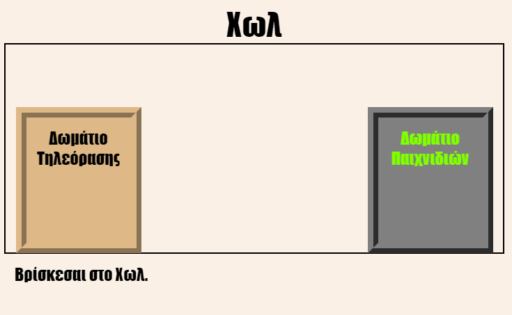
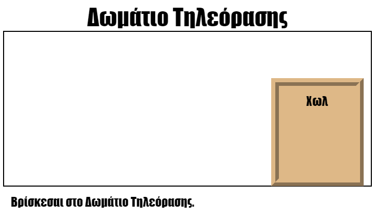

\--- challenge \---

## Πρόκληση: Πρόσθεσε περισσότερες πόρτες!

Μετάτρεψε και τους υπόλοιπους συνδέσμους στο έργο σου σε πόρτες με τον ίδιο τρόπο.

Για κάθε πόρτα θα χρειαστεί να:

+ Τροποποιήσεις τον σύνδεσμο της πόρτας για να χρησιμοποιεί ένα `
` με ένα id όπως `hall2games`, ώστε να μπορείς να το μορφοποιήσεις.
    
    Για παράδειγμα:
    
    `<a href="gamesroom.html">
Δωμάτιο Παιχνιδιών
</a>`

+ Και να προσθέσεις κώδικα CSS για το id της πόρτας στο αρχείο `.css` για το συγκεκριμένο δωμάτιο. Χρησιμοποίησε *αντιγραφή* και *επικόλληση* για να κερδίσεις χρόνο. Μπορείς να κάνεις την κάθε πόρτα διαφορετική αν θέλεις.

+ Να τοποθετήσεις την πόρτα χρησιμοποιώντας `bottom:` και `left:` ή `right:`.

Το Χωλ μπορεί να μοιάζει έτσι:

Το Δωμάτιο Τηλεόρασης θα μοιάζει έτσι:

\--- /challenge \---