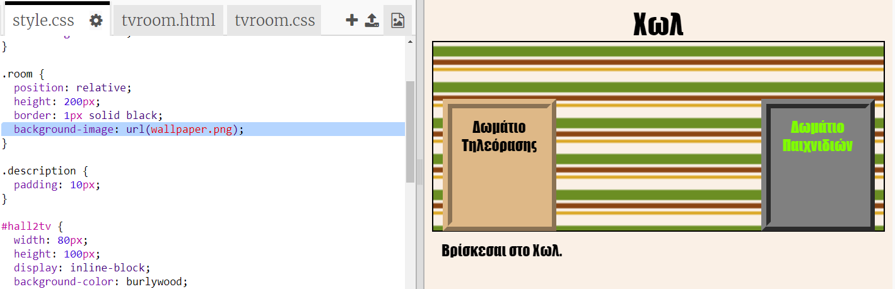

## Προσθέτοντας εικόνα φόντου

Ας διακοσμήσουμε το Χωλ με μια εικόνα φόντου.

+ Άλλαξε το `style.css` για να προσθέσεις μια εικόνα φόντου στο Χωλ:
    
    
    
    Η εικόνα θα επαναλαμβάνεται για να γεμίσει όλο το δωμάτιο.