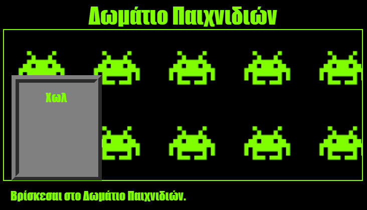

\--- challenge \---

## Πρόκληση: Πρόσθεσε ταπετσαρία στο Δωμάτιο Παιχνιδιών

Μπορείς να διακοσμήσεις το δωμάτιο παιχνιδιών με μια εικόνα φόντου;

Μπορείς να χρησιμοποιήσεις την εικόνα φόντου `space-invader.png` που συμπεριλαμβάνεται στο έργο.

Θα χρειαστεί να:

+ Προσθέσεις ένα `background-image:` στο στοιχείο `.room` του CSS για το Δωμάτιο Παιχνιδιών. 

Το διακοσμημένο δωμάτιο θα μοιάζει με αυτό:

\--- /challenge \---