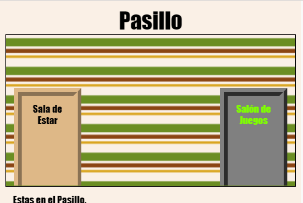

## Introducción

En este proyecto crearas un grupo de habitaciones enlazadas donde cada habitación será una página web, la cual decoraras con HTML.

  <iframe src="https://trinket.io/embed/html/eab49f4f06?outputOnly=true&start=result" width="600" height="450" frameborder="0" marginwidth="0" marginheight="0" allowfullscreen>
  </iframe>
  

**Instrucciones**: Haz clic en las puertas para moverte entre habitaciones.

### Información adicional para líderes de club

Si necesitas imprimir este proyecto, usa la [versión para imprimir](https://projects.raspberrypi.org/en/projects/linked-rooms/print).

## \--- collapse \---

## title: Notas del líder del club

## Introducción:

En este proyecto los niños son introducidos a paginas web con múltiples enlaces en el mismo proyecto, cada una con su propio archivo CSS.

## Recursos en línea

Recomendamos usar [trinket](https://trinket.io/) para programar en HTML y CSS en línea. Este proyecto contiene los siguientes trinkets:

* ['Habitaciones Enlazadas' punto de inicio -- jumpto.cc/web-rooms](https://trinket.io/html/f1486ddb24)

Los niños también pueden hacer uso de este trinket en blanco [ (jumpto.cc/html-blank) ](http://jumpto.cc/html-blank) para escribir su propio HTML & CSS, o pueden usar este trinket plantilla [ (jumpto.cc/html-template) ](http://jumpto.cc/html-template).

También hay un trinket que contiene una solución de muestra para los desafíos:

* ['Habitaciones Enlazadas Solución' -- https://trinket.io/html/ba5d27ec68](https://trinket.io/html/eab49f4f06)

## Recursos sin conexión

Este proyecto se puede [completar sin conexión](https://www.codeclubprojects.org/en-GB/resources/webdev-working-offline/) si se prefiere. Se puede acceder a los recursos del proyecto haciendo clic en el enlace 'Materiales del proyecto' en este proyecto. Este enlace contiene una sección de 'Recursos del proyecto', que incluye los recursos que los niños necesitarán para completar este proyecto sin conexión. Asegúrate de que cada niño tenga acceso a una copia de estos recursos. Esta sección incluye los siguientes archivos:

* linked-rooms/index.html
* linked-rooms/style.css
* linked-rooms/script.js
* linked-rooms/prefixfree.js
* linked-rooms/4 x .png images
* template/template.html
* template/style.css

También puedes encontrar una versión completa de los desafíos de este proyecto en la sección 'Recursos para voluntarios', que contiene:

* linked-rooms-finished/index.html
* linked-rooms-finished/style.css
* linked-rooms-finished/script.js
* linked-rooms-finished/prefixfree.js
* linked-rooms-finished/4 x .png images

(Todos los recursos anteriores se pueden descargar también como archivos `.zip` de proyectos y voluntarios.)

## Objetivos del Aprendizaje

* Se presenta un proyecto con múltiples paginas html entrelazadas
* Se presentan múltiples archivos CSS

Este proyecto incluye elementos desde los siguientes aspectos del [Curríulo Digital de Raspberry Pi](http://rpf.io/curriculum):

* [Diseño de elementos básicos en 2D y 3D](https://www.raspberrypi.org/curriculum/design/creator).

## Desafíos

* “Agrega otro enlace” - Agrega un enlace entre páginas del mismo proyecto;
* “Agrega estilo y enlaza la Habitación de Juego” - Agrega un enlace y dale estilo a un página utilizando su propio archivo CSS. 
* “Agrega mas puertas!” - Utiliza 

      s como enlaces. </li> </ul> 
      
      

        <
      

      
      

        + "Agrega un papel tapiz a la Habitación de Juegos" - Agrega una imagen de fondo + "Hazlo tuyo!" - Agrega mas cuartos utilizando los conocimientos aprendidos + "Agrega un cursor" - Un divertido extra opcional para aquellos que completen el proyecto
      

      
      

        --- /collapse ---
      

      
      <h2>
        --- collapse ---
      </h2>
      
      <h2>
        title: Materiales del proyecto
      </h2>
      
      <h2>
        Recursos del proyecto
      </h2>
      
      <ul>
        <li>
          <a href="https://rpf.io/p/en/linked-rooms-go">Archivo .zip que contiene todos los recursos del proyecto</a>
        </li>
        <li>
          <a href="http://jumpto.cc/web-rooms">Trinket en linea que contiene todos los recursos del proyecto 'Habitaciones Enlazadas'</a>
        </li>
        <li>
          <a href="http://jumpto.cc/trinket-template">Plantilla de Trinket en línea</a>
        </li>
        <li>
          <a href="http://jumpto.cc/trinket-blank">Trinket en blanco en línea</a>
        </li>
        <li>
          <a href="resources/template-index.html">template/index.html</a>
        </li>
        <li>
          <a href="resources/template-style.css">template/style.css</a>
        </li>
        <li>
          <a href="resources/linked-rooms-index.html">linked-rooms/index.html</a>
        </li>
        <li>
          <a href="resources/linked-rooms-style.css">linked-rooms/style.css</a>
        </li>
        <li>
          <a href="resources/linked-rooms-tvroom.html">linked-rooms/tvroom.html</a>
        </li>
        <li>
          <a href="resources/linked-rooms-tvroom.css">linked-rooms/tvroom.css</a>
        </li>
        <li>
          <a href="resources/linked-rooms-wallpaper.png">linked-rooms/wallpaper.png</a>
        </li>
        <li>
          <a href="resources/linked-rooms-space-invader.png">linked-rooms/space-invader.png</a>
        </li>
        <li>
          <a href="resources/linked-rooms-tiles.png">linked-rooms/tiles.png</a>
        </li>
        <li>
          <a href="resources/linked-rooms-star.png">linked-rooms/star.png</a>
        </li>
        <li>
          <a href="resources/linked-rooms-stripes.png">linked-rooms/stripes.png</a>
        </li>
      </ul>
      
      <h2>
        Recursos para los líderes de clubes
      </h2>
      
      <ul>
        <li>
          <a href="https://rpf.io/p/en/linked-rooms-go">Archivo .zip que contiene todos los recursos de proyecto terminado</a>
        </li>
        <li>
          <a href="https://trinket.io/html/eab49f4f06">Proyecto Trinket terminado en línea</a>
        </li>
        <li>
          <a href="resources/linked-rooms-finished-index.html">linked-rooms-finished/index.html</a>
        </li>
        <li>
          <a href="resources/linked-rooms-finished-style.css">linked-rooms-finished/style.css</a>
        </li>
        <li>
          <a href="resources/linked-rooms-finished-tvroom.html">linked-rooms-finished/tvroom.html</a>
        </li>
        <li>
          <a href="resources/linked-rooms-finished-tvroom.css">linked-rooms-finished/tvroom.css</a>
        </li>
        <li>
          <a href="resources/linked-rooms-finished-gamesroom.html">linked-rooms-finished/gamesroom.html</a>
        </li>
        <li>
          <a href="resources/linked-rooms-finished-gamesroom.css">linked-rooms-finished/gamesroom.css</a>
        </li>
        <li>
          <a href="resources/linked-rooms-finished-wallpaper.png">linked-rooms-finished/wallpaper.png</a>
        </li>
        <li>
          <a href="resources/linked-rooms-finished-space-invader.png">linked-rooms-finished/space-invader.png</a>
        </li>
        <li>
          <a href="resources/linked-rooms-finished-tiles.png">linked-rooms-finished/tiles.png</a>
        </li>
        <li>
          <a href="resources/linked-rooms-finished-star.png">linked-rooms-finished/star.png</a>
        </li>
        <li>
          <a href="resources/linked-rooms-finished-stripes.png">linked-rooms-finished/stripes.png</a>
        </li>
      </ul>
      
      

        --- /collapse ---
      
