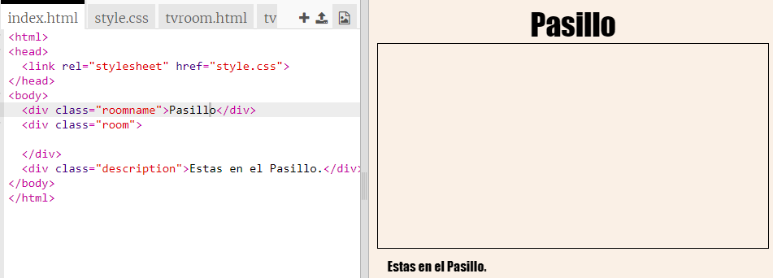
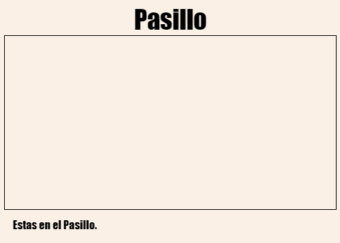
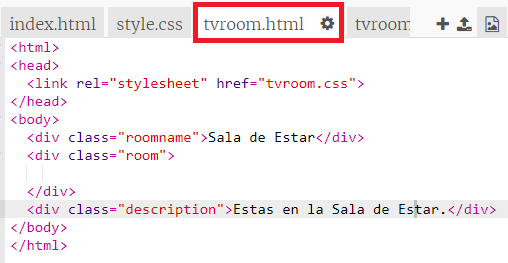
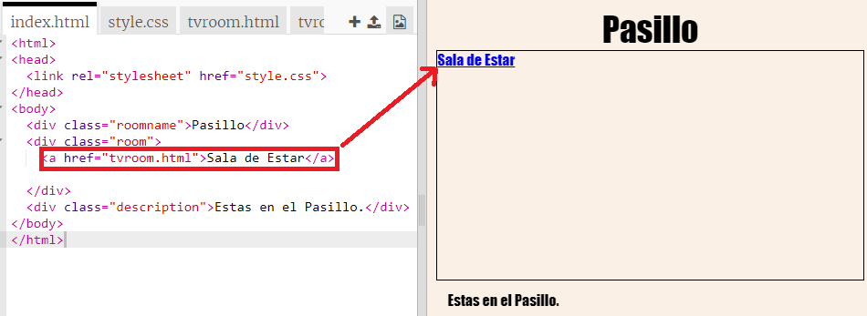
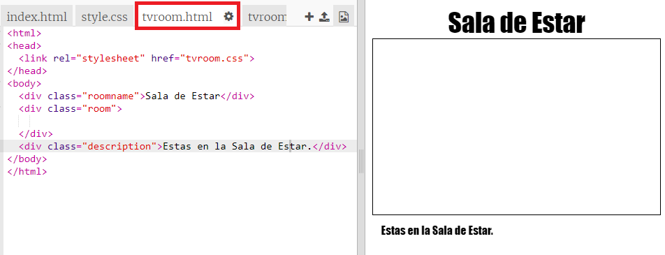

## Crear un enlace a otra página web en el mismo proyecto

Web projects can be made up of lots of HTML files linked together.

+ Open this trinket: <a href="https://trinket.io/html/f1486ddb24" target="_blank">jumpto.cc/web-rooms</a>.
    
    El proyecto debería parecerse a esto:
    
    

+ The trinket should autorun and you will find yourself in the Hall:
    
    

+ Look at the list of file tabs for this trinket. Can you see `tvroom.html`? Click on it.
    
    
    
    This is another html file in the same project.

+ To get to `tvroom.html` you need to add a link in `index.html`.
    
    Add the highlighted code inside the `
` with the class `room`:
    
    

+ Test your trinket by clicking on the **TV Room** link to see the `tvroom.html` webpage.
    
    Note that `tvroom.html` also has its own `tvroom.css` style file which defines the layout for this page.
    
    