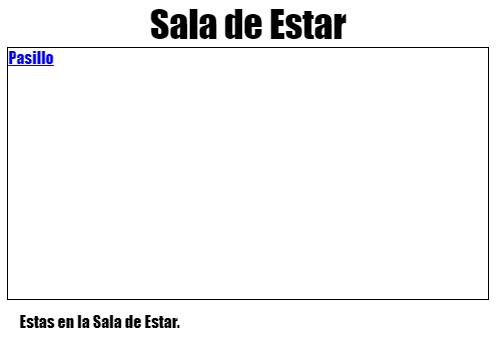

\--- desafío \---

## Desafío: Añadir otro enlace

Añade un `<a>` enlace en la pagina web `tvroom.html` que te dirija de vuelta a la pagina web del Pasillo, la cual es llamada `index.html`. El enlace debe ser "Pasillo".

La pagina web de la Habitación de TV debe tener un enlace como este:

Asegúrate de probar tu código. Debes ser capaz de desplazarte del Pasillo a la Sala de Estar y de regreso dando clic en los enlaces.

\--- /challenge \---