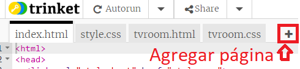
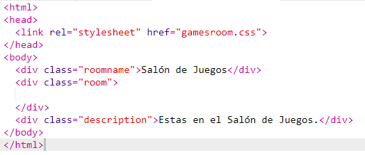
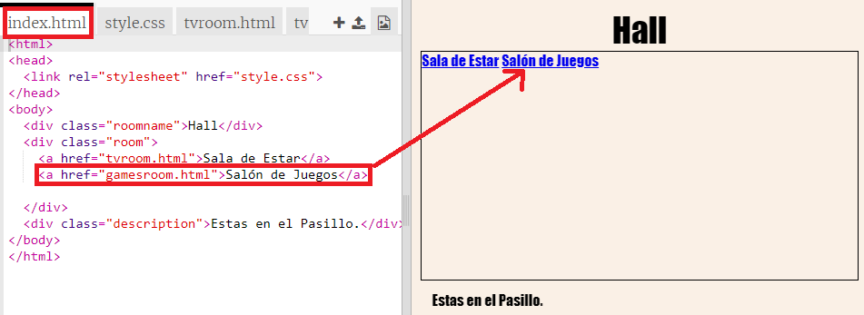
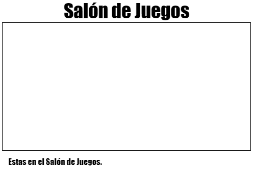

## Añadir otra sala

Ahora vamos a añadir otra sala, una __Sala de juegos__.

+ Haz clic en el botón de añadir página __+__:

	

	Llama a la nueva página `gamesroom.html`:

  

+ El HTML para la __Sala de juegos__ es muy parecido al de `tvroom.html`, así que __copia__ el código y __pégalo__ en `gamesroom.html`.

	Modifica los elementos subrayados para que aparezca juegos en lugar de TV:

	

+ La página `gamesroom.html` está usando `gamesroom.css`, que aún no existe.

	Crea `gamesroom.css` haciendo clic en el botón de añadir página __+__.

+ El CSS de la __Sala de juegos__ es muy parecido al de `tvroom.css`, así que __cópialo__ y __pégalo__ en `gamesroom.css`.

	

+ Crea un enlace en el vestíbulo a la Sala de juegos:

	

+ Prueba tu proyecto haciendo clic en el enlace de la Sala de juegos.

	La __Sala de juegos__ debería de parecerse a esta:

	

	No parece muy interesante, pero podemos arreglarlo en el próximo desafío.

