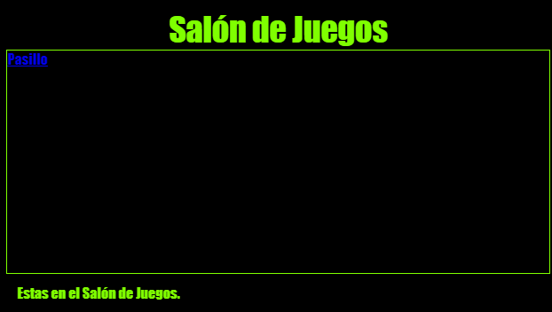

\--- challenge \---

## Desafío: Dar estilo y enlazar el Salón de Juegos

Edita el archivo HTML y el CSS del **Salón de Juegos** para que la página web se vea así:

Pista: Necesitaras cambiar el color de fondo, el color de letra y el color del borde en `salondejuegos.css`. El color verde brillante se llama `chartreuse`.

Pista: Necesitaras un `<a>` enlace en `salondejuegos.html` que conecta con el `pasillo.html`.

\--- /challenge \---