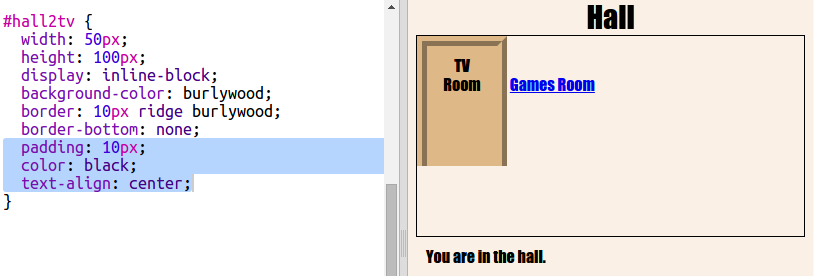

## Haz que los enlaces parezcan puertas

Links don't just have to be text. Let's make a clickable door using a `
`.

+ Open `index.html` and add a `
` around the **TV Room** link text. It needs to be inside the `<a>` to make it clickable.
    
    Add `id="hall2tv"` to label it as the door from the Hall to the TV Room so that you can style the door.
    
    

+ Click on the `style.css` tab, go to the bottom and add the following CSS to change the size and colour of the door:
    
    

+ Test your webpage by clicking anywhere on the door, not just on the text.

+ Now let's make it look a bit more like a door by adding a border around three sides:
    
    

+ And let's add some CSS to make the text on the door look better:
    
    

+ You've probably noticed that the door is floating in the air. Let's fix that by positioning the door inside the room.
    
    

+ Test your webpage by clicking on the door to get to the **TV Room**.