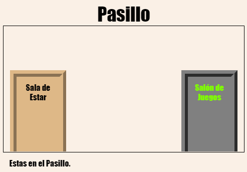
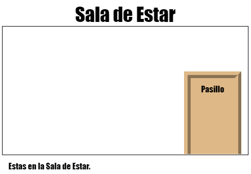

\--- desafío \---

## Desafío: ¡Añadir más puertas!

Turn the other links in your project into doors in the same way.

For each door you'll need to:

+ Edit the door link to use a `
` with an id such as `hall2games` so that you can style it.
    
    Por ejemplo:
    
    `<a href="gamesroom.html">
Games Room
</a>`

+ Add CSS for the door id to the `.css` file for its room. Use *copy* and *paste* to save time. You can make each door look different if you like.

+ Position the door using `bottom:` and `left:` or `right:`.

The Hall might look like this:

The TV Room should look something like this:

\--- /challenge \---