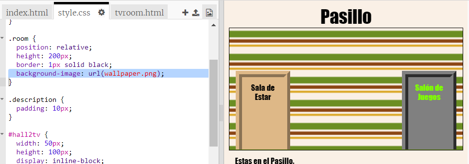

## Añadir una imagen de fondo

Vamos a decorar el vestíbulo con una imagen de fondo.

+  Modifica `style.css` para añadir una imagen de fondo al vestíbulo:

	

	La imagen se repetirá para cubrir la sala entera.

