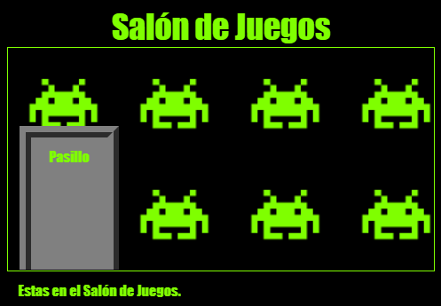

\--- challenge \---

## Desafío: Empapelar la Sala de juegos

Puedes decorar el Salón de Juegos con una imagen de fondo?

Puedes utilizar la imagen `space-invader.png` que esta incluida en tu proyecto.

Tendrás que:

+ Agregar `background-image:` al `.room` CSS del Salón de Juegos. 

El Salón de Juegos debería de verse así:

\--- /challenge \---