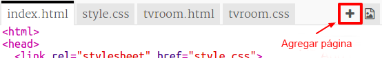
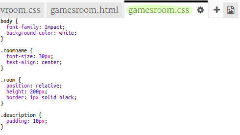

## Añadir otra sala

Ahora agreguemos otra sala, una **Sala de juegos**.

+ Haga clic en el botón añadir página **+**:
    
    
    
    Escribe `saladejuegos.html` como el nombre de la página:
    
    

+ El HTML para la **Sala de juegos** es muy similar a `saladetv.html` entonces **copia** eso y **pegar** en `saladejuegos.html`.
    
    Edite los elementos resaltados para que digan Juegos no TV:
    
    

+ Tu `saladejuegos.html` utiliza `saladejuegos.css` que por el momento no existe.
    
    Crea `saladejuegos.css` haciendo clic en el botón **+**.

+ El CSS para la **Sala de juegos** es muy similar a `saladetv.css` entonces **copia** eso y **pegar** en `saladejuegos.css`.
    
    

+ Agregue un enlace desde el Salón a la Sala de Juegos:
    
    

+ Prueba tu proyecto haciendo clic en el enlace de Sala de Juegos
    
    La **Sala de Juegos** debería verse así:
    
    
    
    No es muy emocionante, pero puedes solucionarlo en el próximo desafío.