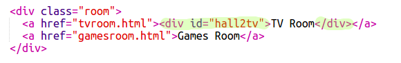

## Haz que los enlaces luzcan como puertas

Los enlaces no tiene que ser solamente texto. Hagamos una puerta en la que se pueda hacer clic con un `
`.

+ Abra `index.html` y agregue un `
` alrededor del enlace de texto **Sala de TV**. Debe estar dentro del `<a>` para que se pueda hacer clic en él.
    
    Añadir `id = "hall2tv"` para etiquetarlo como la puerta del Salón a la Sala de TV para que puedas diseñar la puerta.
    
    

+ Haz clic en la etiqueta `style.css`, ve hasta el final y agrega el siguiente código CSS para cambiar el tamaño y el color de la puerta:
    
    

+ Pruebe su página web haciendo clic en cualquier lugar de la puerta, no solo en el texto.

+ Ahora hagamos que luzca un poco mas como una puerta agregando bordes a los tres lados:
    
    

+ Agreguemos un poco mas de CSS para que la puerta luzca mejor:
    
    

+ Probablemente notaste que la puerta esta flotando sobre el aire. Arreglemos eso colocando la puerta dentro de la sala.
    
    

+ Pruebe su página web haciendo clic en la puerta para llegar a la **Sala de TV**.