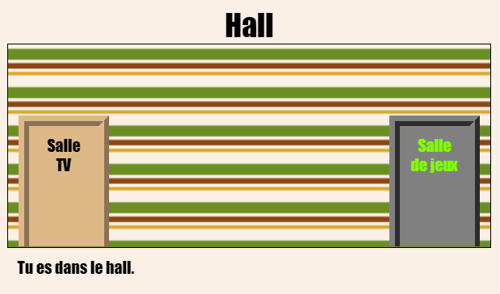

## Introduction

Dans ce projet, tu vas créer un ensemble de salles reliées entre elles où chaque salle est une page Web différente que tu peux décorer avec HTML.

  <iframe src="https://trinket.io/embed/html/eab49f4f06?outputOnly=true&start=result" width="600" height="450" frameborder="0" marginwidth="0" marginheight="0" allowfullscreen>
  </iframe>
  

**Instructions**: Clique sur les portes pour passer d’une salle à une autre.

### Informations complémentaires pour les responsables de club

Si vous avez besoin d'imprimer ce projet, merci d'utiliser la [Version imprimable](https://projects.raspberrypi.org/en/projects/linked-rooms/print).

## \--- collapse \---

## title: Notes pour le responsable de club

## Introduction :

Dans ce projet, les enfants découvrent plusieurs pages Web reliées dans le même projet, chacune avec son propre fichier CSS.

## Ressources en ligne

Nous vous recommandons d'utiliser [trinket](https://trinket.io/) pour écrire HTML & CSS en ligne. Ce projet contient le trinket suivant :

* [Le point de départ des «Salles reliées» - jumpto.cc/web-rooms](https://trinket.io/html/f1486ddb24)

Les enfants peuvent également utiliser ce trinket vide [(jumpto.cc/html-blank)](http://jumpto.cc/html-blank) pour écrire leur propre code HTML & CSS, ou utiliser ce trinket modèle [(jumpto.cc/html-template)](http://jumpto.cc/html-template).

Il y a aussi un Trinket contenant un exemple de solution pour les défis :

* ["Salles reliées terminées" - https://trinket.io/html/ba5d27ec68](https://trinket.io/html/eab49f4f06)

## Ressources hors-ligne

Ce projet peut être [terminé hors-ligne](https://www.codeclubprojects.org/en-GB/resources/webdev-working-offline/) si désiré. Vous pouvez accéder aux ressources du projet en cliquant sur le lien "Matériaux du projet". Ce lien contient une section "Ressources du projet" qui inclut les ressources dont les enfants auront besoin pour compléter le projet hors-ligne. Assurez-vous que les enfants ont accès à une copie de ces ressources. Cette section inclut les fichiers suivants :

* linked-rooms/index.html
* linked-rooms/style.css
* linked-rooms/script.js
* linked-rooms/prefixfree.js
* linked-rooms/4 x .png images
* template/template.html
* template/style.css

Vous pouvez aussi trouver une version terminée du projet dans la section "Ressources du bénévole" qui contient :

* linked-rooms-finished/index.html
* linked-rooms-finished/style.css
* linked-rooms-finished/script.js
* linked-rooms-finished/prefixfree.js
* linked-rooms-finished/4 x .png images

(Toutes les ressources ci-dessus peuvent également être téléchargées dans les fichiers projet et bénévole au format `.zip`)

## Objectifs d'apprentissage

* Ce projet présente des projets avec plusieurs pages html reliées entre elles
* Plusieurs fichiers CSS sont également présentés

Ce projet couvre les éléments suivants du [Programme Raspberry Pi de Créativité Numérique](http://rpf.io/curriculum):

* [Concevoir des éléments de base en 2D et 3D](https://www.raspberrypi.org/curriculum/design/creator).

## Défis

* “Ajouter un autre lien” - Ajoute un lien entre les pages du même projet;
* "Styliser et relier la salle de jeux" - Ajoute un lien et stylise une page avec son propre fichier CSS. 
* “Ajoute plus de portes !” - Utilise 

      s en tant que liens cliquables </li> </ul> 
      
      

        <
      

      
      

        + "Ajouter un fond d'écran à la salle de jeux" - Ajouter une image d'arrière-plan + "Personnalise-le !" - Ajouter plus de salles en utilisant les compétences acquises + "Ajouter un curseur clé" - Un extra optionnel amusant pour ceux qui terminent le projet
      

      
      

        --- /collapse ---
      

      
      <h2>
        --- collapse ---
      </h2>
      
      <h2>
        title: Matériaux du projet
      </h2>
      
      <h2>
        Ressources pour le projet
      </h2>
      
      <ul>
        <li>
          <a href="resources/rooms-project-resources.zip">Fichier .zip contenant toutes les ressources du projet</a>
        </li>
        <li>
          <a href="http://jumpto.cc/web-rooms">Trinket en ligne contenant toutes les ressources du projet "Salles reliées"</a>
        </li>
        <li>
          <a href="http://jumpto.cc/trinket-template">Modèle de Trinket en ligne</a>
        </li>
        <li>
          <a href="http://jumpto.cc/trinket-blank">Trinket en ligne vierge</a>
        </li>
        <li>
          <a href="resources/template-index.html">template/index.html</a>
        </li>
        <li>
          <a href="resources/template-style.css">template/style.css</a>
        </li>
        <li>
          <a href="resources/linked-rooms-index.html">linked-rooms/index.html</a>
        </li>
        <li>
          <a href="resources/linked-rooms-style.css">linked-rooms/style.css</a>
        </li>
        <li>
          <a href="resources/linked-rooms-tvroom.html">linked-rooms/tvroom.html</a>
        </li>
        <li>
          <a href="resources/linked-rooms-tvroom.css">linked-rooms/tvroom.css</a>
        </li>
        <li>
          <a href="resources/linked-rooms-wallpaper.png">linked-rooms/wallpaper.png</a>
        </li>
        <li>
          <a href="resources/linked-rooms-space-invader.png">linked-rooms/space-invader.png</a>
        </li>
        <li>
          <a href="resources/linked-rooms-tiles.png">linked-rooms/tiles.png</a>
        </li>
        <li>
          <a href="resources/linked-rooms-star.png">linked-rooms/star.png</a>
        </li>
        <li>
          <a href="resources/linked-rooms-stripes.png">linked-rooms/stripes.png</a>
        </li>
      </ul>
      
      <h2>
        Ressources pour le responsable de club
      </h2>
      
      <ul>
        <li>
          <a href="resources/rooms-volunteer-resources.zip">Fichier .zip contenant toutes les ressources du projet terminé</a>
        </li>
        <li>
          <a href="https://trinket.io/html/eab49f4f06">Projet Trinket en ligne terminé</a>
        </li>
        <li>
          <a href="resources/linked-rooms-finished-index.html">linked-rooms-finished/index.html</a>
        </li>
        <li>
          <a href="resources/linked-rooms-finished-style.css">linked-rooms-finished/style.css</a>
        </li>
        <li>
          <a href="resources/linked-rooms-finished-tvroom.html">linked-rooms-finished/tvroom.html</a>
        </li>
        <li>
          <a href="resources/linked-rooms-finished-tvroom.css">linked-rooms-finished/tvroom.css</a>
        </li>
        <li>
          <a href="resources/linked-rooms-finished-gamesroom.html">linked-rooms-finished/gamesroom.html</a>
        </li>
        <li>
          <a href="resources/linked-rooms-finished-gamesroom.css">linked-rooms-finished/gamesroom.css</a>
        </li>
        <li>
          <a href="resources/linked-rooms-finished-wallpaper.png">linked-rooms-finished/wallpaper.png</a>
        </li>
        <li>
          <a href="resources/linked-rooms-finished-space-invader.png">linked-rooms-finished/space-invader.png</a>
        </li>
        <li>
          <a href="resources/linked-rooms-finished-tiles.png">linked-rooms-finished/tiles.png</a>
        </li>
        <li>
          <a href="resources/linked-rooms-finished-star.png">linked-rooms-finished/star.png</a>
        </li>
        <li>
          <a href="resources/linked-rooms-finished-stripes.png">linked-rooms-finished/stripes.png</a>
        </li>
      </ul>
      
      

        --- /collapse ---
      
