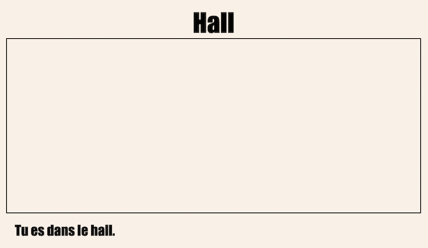

## Établir un lien avec une autre page Web du même projet

Les projets Web peuvent être constitués de nombreux fichiers HTML reliés entre eux.

+ Ouvre ce trinket: <a href="https://trinket.io/html/8ea97127eb" target="_blank">trinket.io/html/8ea97127eb</a>.
    
    Le projet devrait ressembler à ceci :
    
    

+ Le Trinket devrait s'auto-exécuter et tu te retrouveras dans le Hall :
    
    

+ Regarde la liste des onglets de fichiers pour ce trinket. Peux-tu voir `tvroom.html`? Clique dessus.
    
    
    
    Ceci est un autre fichier HTML dans le même projet.

+ Pour obtenir `tvroom.html` tu dois ajouter un lien dans `index.html`.
    
    Ajoute le code en surbrillance à l’intérieur du `
` avec la classe `salle`:
    
    

+ Teste ton trinket en cliquant sur le lien **Salle de télévision** pour voir la page Web `tvroom.html`.
    
    Note que `tvroom.html` a également son propre fichier de style `tvroom.css` qui définit la mise en page de cette page.
    
    