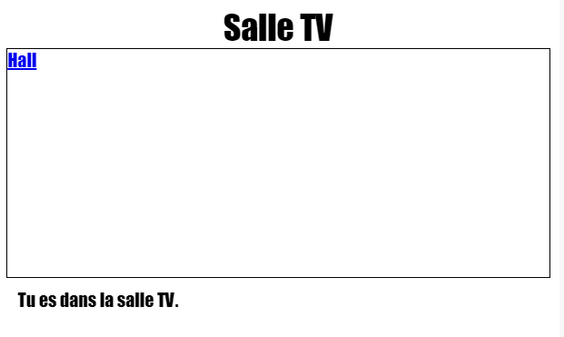

--- challenge ---
## Défi : Ajouter un autre lien 

Ajouter un lien `<a>` sur la page Web `tvroom.html` pour revenir à la page Web Hall qui est appelée `index.html`. Le texte du lien doit être 'Hall'.

La page Web Salon TV doit avoir un lien cliquable comme suit :

Assurez-vous de tester votre code. Vous devriez pouvoir vous déplacer du Hall à Salon TV et revenir en cliquant sur les liens.  

--- /challenge ---