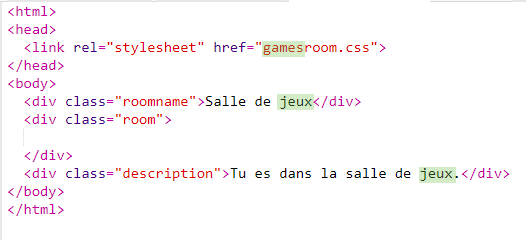

## Ajouter un autre salon

Maintenant ajoutons un autre salon, un __Salon de jeux__. 

+ Cliquez sur le bouton ajouter une page __+__ :

	

	Inscrivez `gamesroom.html` comme nom de page :

  

+ Le HTML pour le __Salon de jeux__ est très similaire à `tvroom.html` donc __copiez_ ceci et__collez-le__ dans `gamesroom.html`.
	
	Modifiez les objets mis en relief pour qu'ils indiquent Jeux et non TV :

		

+ Votre `gamesroom.html` utilise maintenant `gamesroom.css` qui n'existe pas encore. 

	Créez `gamesroom.css` en cliquant sur le bouton ajouter une page __+__. 

+ Le CSS pour le __Salon de jeux__ est très similaire à `tvroom.css` donc __copiez_ ceci et__collez-le__ dans `gamesroom.css`.

	

+ Ajoutez un lien du Hall vers le Salon de jeux :

	

+ Testez votre projet en cliquant sur le lien du Salon de jeux

	Le __Salon de jeux__ doit ressembler à ceci :

	

	Pas très excitant, mais vous pouvez corriger cela dans le prochain challenge. 

