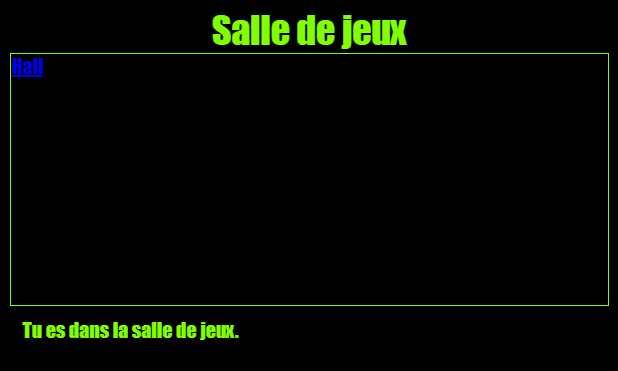

\--- challenge \---

## Défi : Styliser et relier la Salle de jeux

Modifier le code HTML et CSS pour la **salle de jeux** pour que la page Web ressemble comme ceci :

Astuce: tu auras besoin de changer la couleur de l'arrière-plan, la couleur de la police et la couleur de la bordure dans `gamesroom.css`. La couleur vert vif s'appelle `chartreuse`.

Astuce: tu auras besoin d’ajouter un lien `<a>` dans `gamesroom.html` qui lie vers `index.html`.

\--- /challenge \---