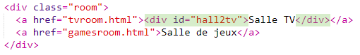
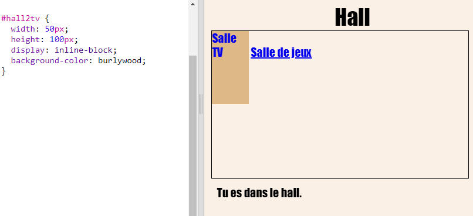
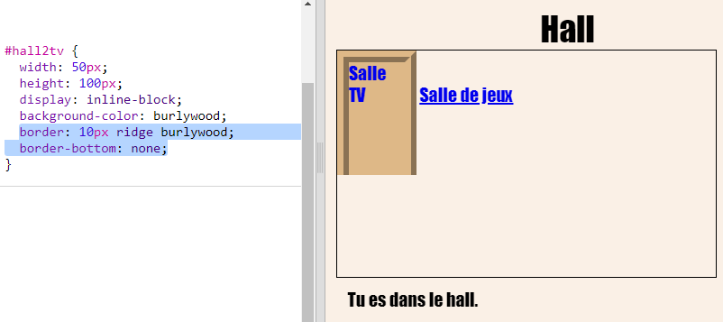
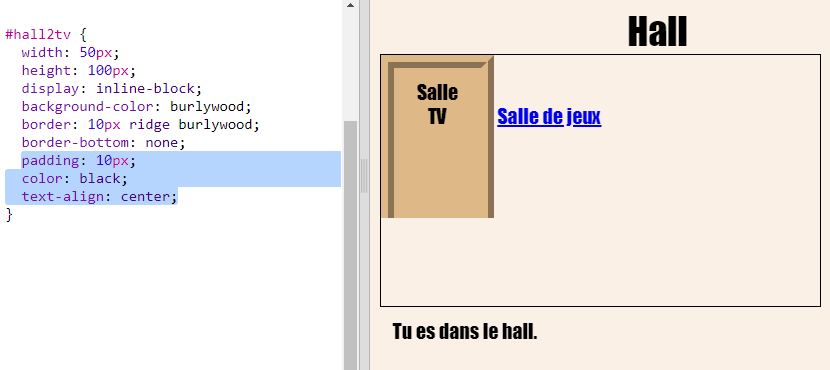
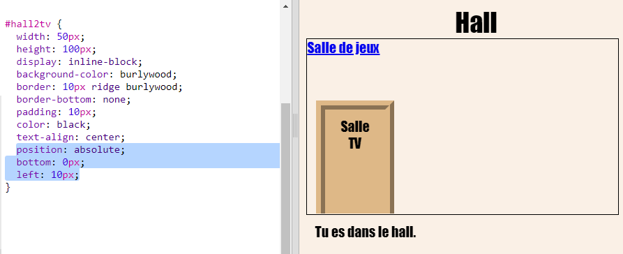

## Faire en sorte que les liens ressemblent à des portes

Les liens ne doivent pas seulement être du texte. Faisons une porte cliquable en utilisant un `
`.

+ Ouvre `index.html` et ajoute `
` autour du texte du lien **Salle de télévision**. Il doit être à l'intérieur du `<a>` pour le rendre cliquable.
    
    Ajoute `id="hall2tv"` pour l’étiqueter en tant que porte du Hall vers la salle de télévision afin que tu puisses styliser la porte.
    
    

+ Clique sur l'onglet `style.css` , va en bas et ajoute le CSS suivant pour changer la taille et la couleur de la porte :
    
    

+ Teste ta page Web en cliquant n'importe où sur la porte, pas seulement sur le texte.

+ Maintenant, faisons le un peu plus ressembler à une porte en ajoutant une bordure autour de trois côtés :
    
    

+ Et ajoutons un peu de CSS pour que le texte de la porte soit plus beau :
    
    

+ Tu as probablement remarqué que la porte flotte dans les airs. Corrigeons cela en plaçant la porte à l'intérieur de la salle.
    
    

+ Teste ta page Web en cliquant sur la porte pour accéder à la **Salle de télévision**.