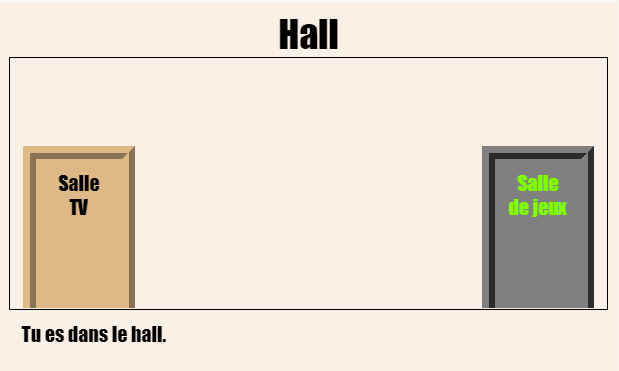
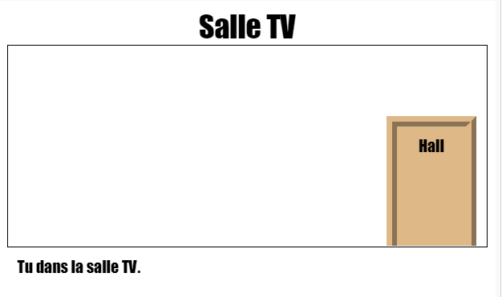

--- challenge ---

## Défi : Ajouter plus de portes !

Transforme les autres liens de ton projet en portes de la même manière.

Pour chaque porte, tu devras :

+ Modifier le lien de porte pour utiliser `
` avec un identifiant tel que `hall2games` afin de pouvoir le styliser.
    
    Par exemple :
    
    `<a href="gamesroom.html">
Salle de jeux
</a>`

+ Ajoute le CSS pour l’identifiant de la porte au fichier `.css` correspondant à sa salle. Utilise *copier* et *coller* pour gagner du temps. Tu peux rendre chaque porte différente si tu le souhaites.

+ Positionne la porte en utilisant `bottom:` et `left:` ou `right:`.

Le Hall pourrait ressembler à ceci :

La salle de télévision devrait ressembler à ceci :

--- /challenge ---