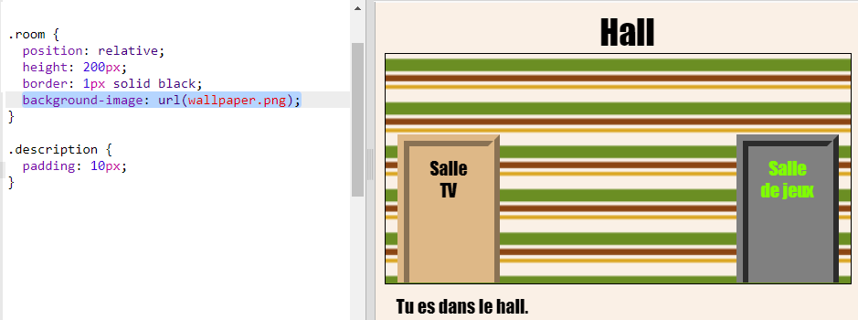

## Ajouter une image d'arrière-plan

Nous allons décorer le hall avec une image d'arrière-plan.

+ Modifie le `style.css` pour ajouter une image d’arrière-plan à la salle :
    
    
    
    L'image sera répétée pour remplir la salle tout entière.