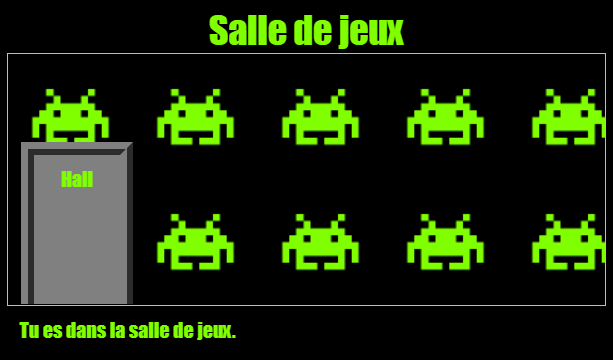

\--- challenge \---

## Défi : Ajouter un fond d'écran à la Salle de jeux

Peux-tu décorer la salle de jeux avec une image d'arrière-plan ?

Tu peux utiliser l'image d'arrière-plan `space-invader.png` incluse dans ton projet.

Tu auras besoin d' :

+ Ajouter un `background-image:` au CSS `.salle` de la salle de jeux. 

La salle décorée devrait ressembler à ceci :

\--- /challenge \---