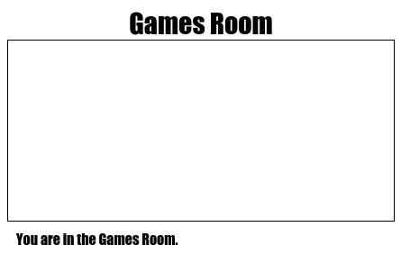

## अन्य कमरा जोड़ें

चलिए अब अन्य कमरा, __Games Room__ (गेम्स रूम) जोड़ें। 

+ पृष्ठ जोड़ें __+__ बटन पर क्लिक करें:

	

	पेज के नाम के लिए `gamesroom.html` टाइप करें:

  	

+ __Games Room__ (गेम्स रूम) के लिए HTML काफी हद तक `tvroom.html` जैसा होता है इसलिए इसे __कॉपी करें__ और `gamesroom.html` में __पेस्ट__ करें।
	
	हाइलाइट किए गए आइटम्स को संपादित करें, ताकि वे TV की बजाए गेम्स कहें:

		

+ आपका `gamesroom.html` अब `gamesroom.css` का उपयोग करता है, जो अभी तक मौजूद नहीं है। 

	पृष्ठ जोड़ें __+__ बटन पर क्लिक करके `gamesroom.css` बनाएँ। 

+ __Games Room__ (गेम्स रूम) के लिए CSS काफी हद तक `tvroom.css` जैसा होता है इसलिए इसे __कॉपी करें__ और `gamesroom.css` में __पेस्ट__ करें।

	

+ हॉल से गेम्स रूम तक लिंक जोड़ें:

	

+ गेम्स रूम के लिंक पर क्लिक करके अपने प्रोजेक्ट का परीक्षण करें

	__Games Room__ (गेम्स रूम) ऐसा दिखाई देना चाहिए:

	

	बहुत रोमांचक नहीं है, परन्तु आप इसे अगली चुनौती में ठीक कर सकते हैं। 

