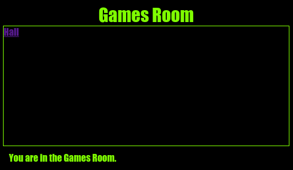

\--- challenge \---

## चुनौती: Games Room को स्टाइल दें और लिंक करें

**Games Room** के लिए HTML और CSS को एडिट (edit) करें ताकि वेबपेज (webpage) इस तरह दिखे:

संकेत: आपको `gamesroom.css` में पृष्ठभूमि रंग (background colour), फ़ॉन्ट रंग (font colour) और सीमा रंग ( border colour) बदलने की आवश्यकता होगी | चमकीले हरे रंग को `chartreuse` कहा जाता है |

संकेत: आपको `gamesroom.html` में `<a>` लिंक जोड़ना होगा जो `index.html` से लिंक करता है ।

\--- /challenge \---